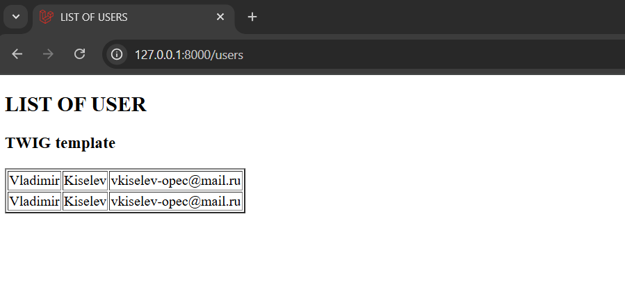
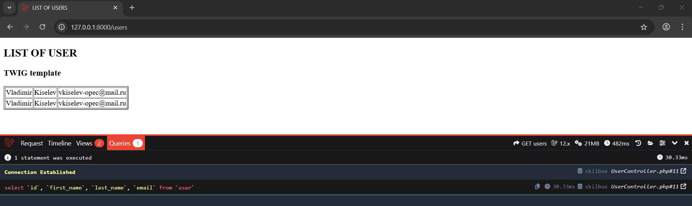
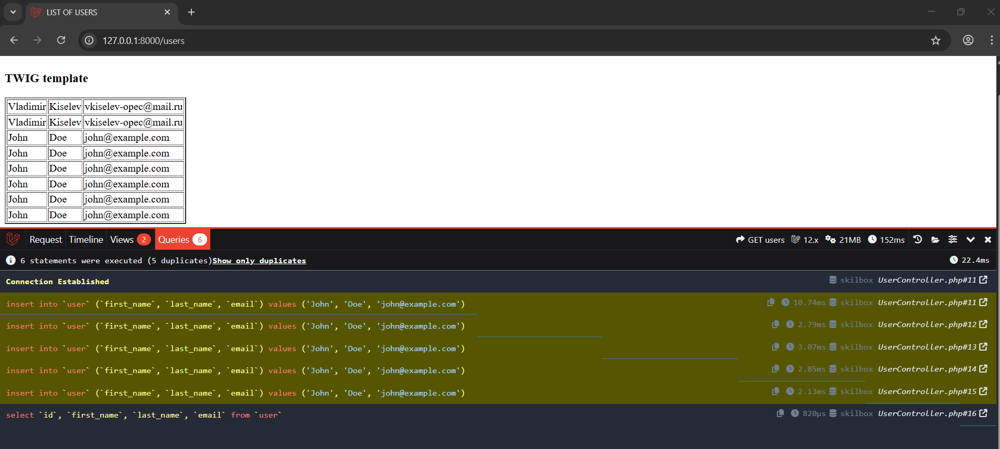

Laravel

## Installing Laravel

The installation process of Laravel is quite simple. Follow these steps:

1. PHP & Composer
   For Composer and Laravel to work, you need PHP. Check if it is installed by running the following command in the terminal or command line:

```
php -v
```

Check if php is added to the path. If not, add it to the path:

```
export PATH="$PATH:/path/to/php"
```

2. Install Composer

```
curl -sS https://getcomposer.org/installer | php
```

After that, move composer.phar to the global folder to use it from any directory.

If you have problems and can't find composer.phar, you can download it from [ link ](https://getcomposer.org/download/) .

If the OpenSSL extension is not enabled in your PHP installation, fix it by uncommenting it in the php.ini file.

```
;extension=openssl
```

Now that Composer is installed, you can use it to manage dependencies in your PHP projects, such as installing Laravel:

```
composer create-project --prefer-dist laravel/laravel my-project
```

This will create a new Laravel project in the my-project directory.

## Possible problems

You may get an error about missing extension for working with archives. In this case, uncomment the line in php.ini:

```
extension=zip
```

The same applies to the extension for working with fileinfo:

```
extension=fileinfo
```

If you have problems with dependencies, you can use the command:

```
composer install
npm install
```

If you see a timeout message, you can disable the timeout by adding disableProcessTimeout to your script.

Sample composer.json file
If you want to see what this might look like in your composer.json, here's an example:

```
{
"scripts": {
"dev": "npx concurrently -c \"#93c5fd,#c4b5fd,#fb7185,#fdba74\" \"php artisan serve\" \"php artisan queue:listen --tries=1\" \"npm run dev\""
}
}
```

If you get a MissingAppKeyException error, you can create a key using the command:

```
php artisan key:generate
```

This is what the key in the .env file should look like after generation:

```
APP_KEY=base64:12345678901234567890123456789012345678901
```

To work with Laravel, you will also need MySQL, PostgreSQL, SQLite or MariaDB. You can install them using the packages you installed earlier.

To install MySQL, PostgreSQL, SQLite or MariaDB, you need to run the following commands:

```
composer require laravel/mysql
composer require laravel/postgres
composer require laravel/sqlite
composer require laravel/mariadb
```

If you want to use a local database file, you can use the .env.local file, which will only be used when running Laravel in development mode:

```
SESSION_DRIVER=file
```

If you want to use the database in development mode and in production mode:

```
DB_CONNECTION=mysql
DB_HOST=127.0.0.1
DB_PORT=3306
DB_DATABASE=laravel
DB_USERNAME=root
DB_PASSWORD=123
```

## Server startup:

```
php artisan serve
```

## Creating a controller

Controllers can be created manually, or you can use the command:

```
php artisan make:controller TestController
```

This command will create an empty controller without public methods inherited from the Controler class built into Laravel. You can add public methods that will be available in the application.

```

public function index()
{
echo "Hello World!";
}
```

However, to access the controller, you need to create a route that points to it.

To do this, you can create a web.php file in the routes directory and add the following code to it:

```
Route::get('/test', [\App\Http\Controllers\TestController::class, 'index']);
```

This route will point to the TestController controller and call the index method.

If our controller contains only one action, you can use single action controller with invoke and not specify the method we call in the routing settings.

To do this, in the controller, replace the method name with invoke and remove it from the route:

```
class TestController extends Controller
{
public function __invoke()
{
echo "Hello World!";
}
}
```

Don't forget that in this case we don't need to use an array:

```
Route::get('/test', \App\Http\Controllers\TestController::class);
```

## Connecting to the database

Laravel uses the Eloquent ORM framework to connect to the database. This library allows you to work with the database in the PHP object format.

Let's create a database and a users table with user data. You can use PHP MyAdmin or MySQL Workbench for this.

Create a table users with fields id, first_name, last_name, email. Fill it with data. Next, in the file .env update the connection settings.

Let's create a controller by entering the following into the console:

```
php artisan make:controller UserController
```

In the UserController.php file, add a method that will return data from the users table:

```
public function __invoke()
{
$users = DB::connection('mysql')->table('user')->select(['first_name', 'last_name', 'email'])->get();
print_r($users);
}
```

Let's not forget that we need to import the connection to the DB using Laravel capabilities:

```
use Illuminate\Support\Facades\DB;
```

Let's write the route in the routes/web.php file:

```
Route::get('/users', \App\Http\Controllers\UserController::class);
```

Here we used the single action controller principle, since there are no other methods in our controller.

## Connecting a page template

The user can be returned not only simple command results, but also a response with a page template. For this, you can use the view method.

To do this, in the directory of the same name /resources/views/ we will create a template users.blade.php:

````
<table>
@foreach ($users as $user)
<tr>
<td>{{$user->first_name}}</td>
<td>{{$user->last_name}}</td>
<td>{{$user->email}}</td>
</tr>
@endforeach

</table>
```
````

And in the showUsers function in the UserController.php controller, add the following code:

```
return view('users', ['users' => $users]);
```

Now we can control logic and presentation separately.

## Installing packages, Composer

Installed packages or dependencies can be seen in the composer.json file. To install packages that you have installed previously, you can use a command like:

```
composer require laravel/mysql
```

In the vendor folder you will find the packages you installed, including the autoload.php autoloader.

A list of official Composer repositories can be found [ here ](https://packagist.org/) .

Let's say we want to switch from the blade template engine built into Laravel to another template engine, such as Twig. To do this, you'll need to install the Twig package and its autoloader.

Let's find the Twig repository on [ Packagist ](https://packagist.org/packages/rcrowe/twigbridge) and install it:

```
composer require rcrowe/twigbridge
```

We execute the command for configuration files:

```
php artisan vendor:publish --provider="TwigBridge\ServiceProvider"
```

Our new dependency has appeared in composer.json.

Let's create a new user.twig template in /resources/views/:

```
<h1>USERS LIST</h1>
<table>

<tr>
<td>{{ user.first_name }}</td>
<td>{{ user.last_name }}</td>
<td>{{ user.email }}</td>
</tr>


</table>
```

As we can see, the syntax here is slightly different.

Now in the controller, change the template name to user

```

return view('user', ['users' => $users]);

```

As we can see, we have a list of users displayed.



## Profiler and its connection

The profiler allows you to simulate user actions and track their execution time. To do this, add the following lines to the .env file:

```
APP_DEBUG=true
```

In this case, Laravel will output all errors to the file [ /storage/logs/laravel.log ](./laravel-project/storage/logs/laravel.log)

We will also install a dependency - the profiler panel from the Composer repositories, for example, barryvdh/laravel-debugbar:

```
composer require barryvdh/laravel-debugbar --dev
```

Next, we will generate configuration files:

```
php artisan vendor:publish --provider="Barryvdh\Debugbar\ServiceProvider"
```

Don't forget to clear the cache after making changes to the configuration:

```
php artisan config:cache
```

Once you open the page, you may notice that we have a profiler panel.



Let's add a query to [ UserController ](./laravel-project/app/Http/Controllers/UserController.php) to insert data into our table:

'''
DB::connection('mysql')->table('user')->insert(['first_name' => 'John', 'last_name' => 'Doe', 'email' => 'john@example.com']);
DB::connection('mysql')->table('user')->insert(['first_name' => 'John', 'last_name' => 'Doe', 'email' => 'john@example.com']);
DB::connection('mysql')->table('user')->insert(['first_name' => 'John', 'last_name' => 'Doe', 'email' => 'john@example.com']);
'''

Let's see how these changes are displayed in the profiler.


