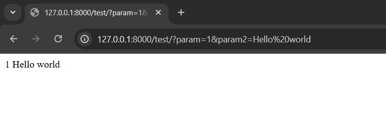
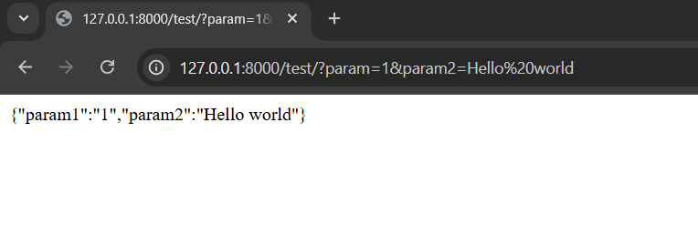
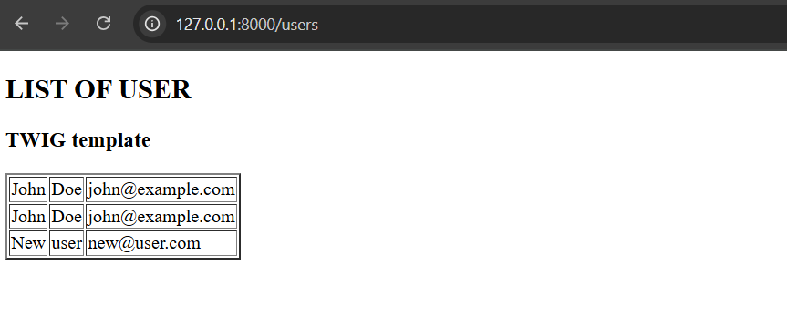
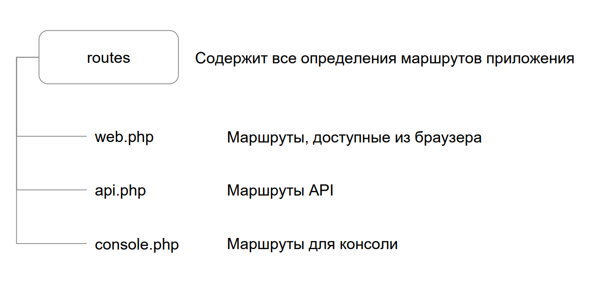
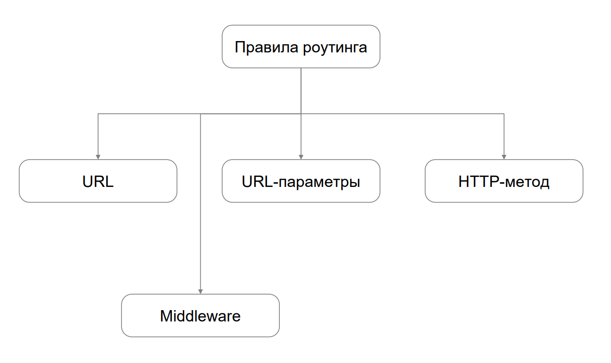
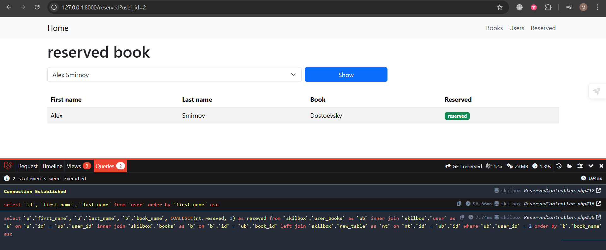
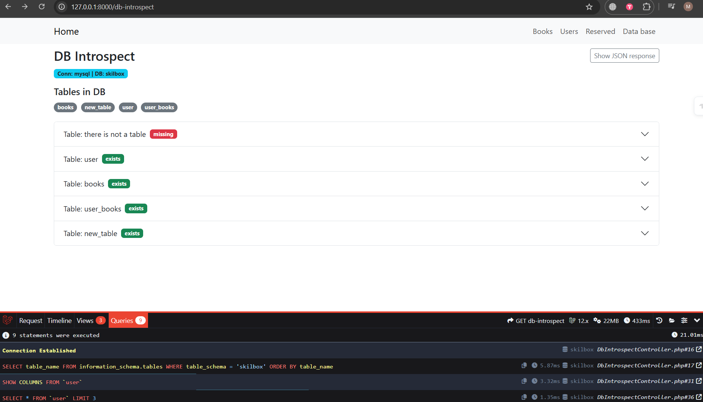

## Controllers, actions and routing

User actions are processed in regular controllers, as well as single action controllers and resource controllers.

Single action - these are controllers that contain only one action.

Resource controllers are defined for a specific model. These controllers are generated automatically by the artisan command and generate CRUD methods for the model.

### Request Methods

Request allows you to access the headers, body of the request, and other parameters such as user, URL, and so on.

| Method | Description                                |
| ------ | ------------------------------------------ |
| all    | Get all fields from query                  |
| get    | Get a specific field from a query          |
| header | Get header from request                    |
| method | Get HTTP request method                    |
| isJson | Check if the request body is a JSON object |
| ip     | Get Client IP Address                      |
| url    | Get Request URL                            |

### Response Methods

Some useful Response methods.

| Method      | Description                   |
| ----------- | ----------------------------- |
| cookies     | Set cookies                   |
| redirect    | Perform redirect              |
| header      | Set response header           |
| withHeaders | Send list of headers as array |
| view        | Submit completed template     |

As an example, let's create a test controller in the project:

```
php artisan make:controller SimpleController
```

IN file [ SimpleController.php ](./laravel-project/app/Http/Controllers/SimpleController.php) add action test for processing http request :

```
public function test(Request $request)
    {
        var_dump ($ request );
}
```

request object will store all the request data.

To access our controller, we will write a route in the file [ routes / web.php ]( ./ laravel-project / routes / web.php ) :

```
Route::get('/test', [\App\Http\Controllers\SimpleController::class, 'test']);
```

As a result, we received a page with all the request data.

Let's process our request with parameter 1:

```
http://127.0.0.1:8000/test/?param=1
```

For this let's change V file [ SimpleController.php ](./laravel-project/app/Http/Controllers/SimpleController.php) method :

```
public function test(Request $request)
    {
        echo $ request -> param ;
}
```

As a result, the browser will display one.

We can add a second parameter and access it:

```
http://127.0.0.1:8000/test/?param=1&param2=Hello%20world
```

```
public function test(Request $request)
{
echo $request->param . ' ' . $request->param2;
}
```



What if we collect all the parameters into an array and output them in Json format ?

```
public function test(Request $request)
{
$response = ['param1'=>$request->param, 'param2'=>$request->param2];
    }
```

To send a response we can use the response class with a method to convert to json :

```
public function test(Request $request)
{
$response = ['param1' => $request->param, 'param2' => $request->param2];
return new Response(json_encode($response));
}
```



In doing so, we can simplify return new Response( json_encode ($ response )) using Laravel functionality :

```
return response () -> json ($ response );
```

### Actions

In the context of Laravel, a controller is a class inherited from Laravel's built-in Controller class . Each public method of such a class is called an action and is responsible for handling a particular url .

```
class TestController extends Controller
{
public function testAction()
{
// ...
}
}
```

One of the frequent cases of action is the processing of forms:


The peculiarity of this action is that it accepts data using the http POST method and must perform a check using Cross- Site - Request-Forgery (CSRF) protection against cross-site request forgery.

This token is used to verify that the data from the form comes from your site.

If you use a template engine blade in Laravel , then in the form you can add the csrf_field tag , which will add the CSRF token to the form. It should be inside the form code:

```
< form action ="/ test " method ="POST">
    @csrf
<input type="text" name="param">
<input type="submit" value="Submit">
</form>
```

If you are using a manual form, you can add the CSRF token manually:

```
<input type="hidden" name="_token" value="{{ csrf_token() }}">
```

Let's create form For additions users on website And we organize her processing With with help action controller [ AddUserController.php ](./laravel-project/app/Http/Controllers/AddUserController.php) .

Let's define two methods:

- to display the form on the screen
- to send data to the server

```
  public function index()
{

}

public function store(Request $request)
    {

}
```

Для разметки формы воспользуемся шаблонизатором blade. Создадим файл [resources/views/add_user.blade.php](./laravel-project/resources/views/add_user.blade.php):

```
    <form class="contact-form" method="POST" action="{{ url('register') }}">
        @csrf
        <input type="text" name="first_name">
        <input type="text" name="last_name">
        <input type="text" name="email">
<input type="submit" value="Submit">
    </form>
```

Let's add a display method to the form:

```
public function index()
{
return view('add_user');
    }
```

Let's add a method for processing data:

```
public function store(Request $request)
{

Log::info('AddUserController@store hit', $request->only(['first_name', 'last_name', 'email']));

        $validated = $request->validate([
            'first_name' => 'required|string|max:255',
            'last_name' => 'required|string|max:255',
            'email' => 'required|email|max:255|unique:user,email',
        ]);

        $ok = DB::connection('mysql')->table('user')->insert([
            'first_name' => $validated['first_name'],
            'last_name' => $validated['last_name'],
            'email' => $validated['email'],
        ]);

        Log::info('AddUserController@store insert result', ['ok' => $ok]);

return redirect('/users')->with('status', $ok ? 'User added successfully ' : 'Failed to add user');
}

```

Let's clear the cache and reload the page. Let's add data to the form and send it to the server.



### Routing setup

From the user's side, Laravel presents only one entry point - the /public/index.php file .
The rest of the URL structure is handled by the internal routing mechanism .


Routing is the process of matching relative URLs against the routing rules that the programmer describes and then invoking the appropriate controller action .

```
Route::get('user-profile',
[UserController::class, 'show']);
```

Routes By default :



Rules routing :



To specify the http method available for the route, you can use the match function of the route class .

```
Route::match(['get', 'post'], '/test', function()
{
return 'This is test';
});
```

The URL /test will be to be called upon function that returns text the line This is test. The URL will be available via the HTTP methods GET and POST. If you only specified post , your method will not be available via other requests.

Sometimes it may be necessary to track URL segments in your route. For example, you may want to track the user ID from the URL. You can do this by specifying parameters
route in curly brackets:

```
Route::get('/user/{id}', function ($id) {
return 'User '.$ id ;
});
```

Let's look at an example. Let's create a controller [ Entity Controller ](./laravel-project/app/Http/Controllers/EntityController.php) and add a method to it to display a page with user information:

```
php artisan make:controller EntityController
```

Let's assume this controller manages a list of books in a library. We won't use models to simplify our example.

- Route parameter limitation at the routing level :
  - DELETE / books / { id } -> whereNumber (' id ') ensures that id is numeric
- Validation of the id parameter via FormRequest :
  - app/Http/Requests/DeleteBookRequest.php
  - Rules : id — required|integer|min:1| exists:books ,id
  - The validationData ( ) method adds the id from the URL to the validation data array
- Controller accepts validated request :
  - public function destroy(DeleteBookRequest $request, int $id)
  - If validation is successful, the id exists in the DB; if the record has already been deleted due to a race, the controller correctly reports this
- Form safety:
  - The DELETE method is achieved through the hidden field \_ method =DELETE
  - CSRF protection via {{ csrf _field () }}
- UI and messages:
  - Flash messages about success/deletion status are displayed on the book.twig page

## Rendering templates

In our tutorial project we use Twig templates for the book, user and reserves pages. Key points of the implementation:

- Basic layout

  - resources / views / layout.twig — a common template with a menu (Home, Books, Users, Reserved ) from which pages are inherited.

- Pages

  - Books: resources / views / book.twig - list of books, add form (POST / books ), delete (DELETE / books / { id }).
  - Users: resources / views / users.twig - list of users, form for adding (POST / users ), deleting (DELETE / users /{ id }).
  - Home: resources / views / home.twig — search by books table and card showcases.
  - Reserved : resources / views / reserved.twig - dropdown list of users and table of their books with reserved flag .

- Controllers return Twig views via a standard helper view ( ' name ', data ). For example :

```
return view('book', ['books' => $books]);
return view('users', ['users' => $users]);
```

- Connection To DB : DB:: connection('mysql')->table(...)

- Reserved (combining data from multiple tables) using JOIN for output : user_books → user → books → new_table.

- Safety

  - Forms are protected by CSRF: {{ csrf _field ()| raw }}
  - DELETE method for deletion - via hidden field method =DELETE.

- Routes

  - books: GET /books, POST /books, DELETE /books/{id}
  - users: GET /users, POST /users, DELETE /users/{id}
  - reserved: GET /reserved?user_id=ID

In addition, we have added bootstrap connection to the templates for minimal project design.



## Base data

Exclusively For visual process developments project For checks structures tables And data added [ controller ](./laravel-project/app/Http/Controllers/DbIntrospectController.php) , [ template ](./laravel-project/rsources/views/db_introspect.twig) , [ route ](./laravel-project/routes/web.php) . The page is available via route db-introspect .

Showing:

- Current connection (DB_CONNECTION) and database (DB_DATABASE)
- Full list of tables in the database ( badge -list)
- For key tables (user, books, user_books, new_table):
  - scroll columns V view tables (Field, Type, Null, Key, Default, Extra)
  - first 3 rows of data (table; for complex structures - JSON fallback )

Data is displayed in JSON format via JSON.stringify ().



### DB Migrations

The project uses Laravel migrations to create and update the database schema. Final structure tables :

- user
  - id (bigIncrements, PK)
  - first_name (string 255)
  - last_name (string 255)
  - email (string 255, unique)
  - timestamps
- books
  - id (bigIncrements, PK)
  - book_name (string 255, index)
  - timestamps
- user_books
  - id (bigIncrements, PK)
  - user_id (unsignedBigInteger, FK -> user.id, ON DELETE CASCADE)
  - book_id (unsignedBigInteger, FK -> books.id, ON DELETE CASCADE)
  - unique(user_id, book_id)
  - timestamps
- new_table
  - id (unsignedBigInteger, PK и одновременно FK -> user_books.id, ON DELETE CASCADE)
  - reseved (boolean, default 0)
  - timestamps

Files migrations :

- database/migrations/2025_08_20_000001_create_user_table.php
- database/migrations/2025_08_20_000002_create_books_table.php
- database/migrations/2025_08_20_000003_create_user_books_table.php
- database/migrations/2025_08_20_000004_create_new_table_table.php

Seeding (demo data):

- database / seeders / DatabaseSeeder.php adds 2 users, 2 books, 3 connections and statuses for example.

Launching migrations and seeds :

1. Set up. env (DB_HOST, DB_PORT, DB_DATABASE, DB_USERNAME, DB_PASSWORD)
2. Run migrations: php artisan migrate
3. Fill in test data (optional): php artisan db:seed
4. To completely recreate the database: php artisan migrate: fresh --seed

Notes:

- The code uses a single query style: DB:: connection (' mysql ')-> table (...)
- For the page / reserved the join is user_books → user → books → new_table (LEFT JOIN for new_table )
- To diagnose the structure use / db-introspect
