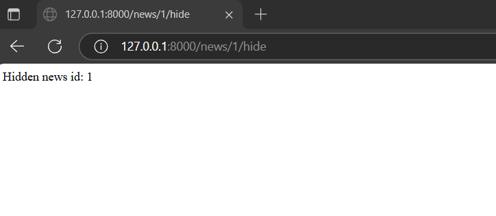
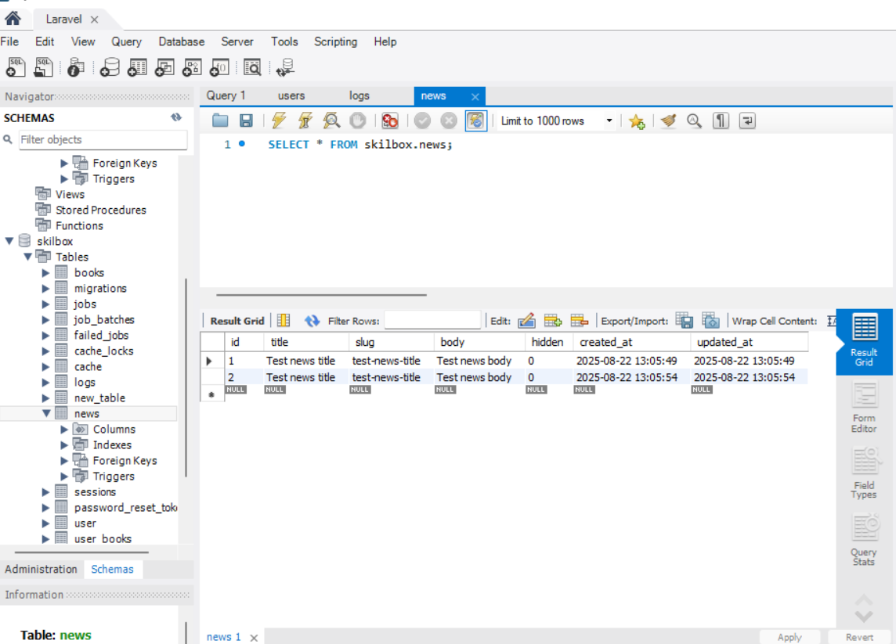

# Working with events

Let's try to demonstrate the system of events/listeners/observers using the example of the News entity using the project.

## Migration

For beginning we will do it [migration For tables news ](./laravel-project/database/migrations/2025_08_22_000000_create_news_table.php) :

## Model

Let's get ready model [News](./laravel-project/app/Models/News.php)

```
{
protected $table = 'news';
protected $fillable = ['title', 'slug', 'body', 'hidden'];
}
```

## Event And listener

Let's create event [NewsHidden](./laravel-project/app/Events/NewsHidden.php) which through constructor accepts News $news and saves in $this ->news

Let's create listener [NewsHiddenListener](./laravel-project/app/Listeners/NewsHiddenListener.php) which V handle() takes News $news and outputs V log message "News $news->id hidden"

We will register their V provider [EventServiceProvider](./laravel-project/app/Providers/EventServiceProvider.php)

## Routes

Let's create routes for creating and hiding news:

- GET /news/create-test
  - Creates test entry (title: "Test news title", body and etc. )
  - Returns : "Created news id: X"
- GET /news/{id}/hide
  - Sets hidden=true, saves News and dispatch event NewsHidden :: dispatch($news)
  - Returns:"Hidden news id: X"

After the hide request, the entry "News X hidden " will appear in storage / logs /laravel.log

### Model Observer

Let's create an observer for the News model [ NewsObserver ]( ./ laravel-project / app / Observers / NewsObserver.php ) which in saving ( ) sets the slug field from the news title:

```
saving(News $news):$news->slug = Str::slug($news->title)
```

We will register his V provider [ AppServiceProvider ](./laravel-project/app/Providers/AppServiceProvider.php) :

```
app/Providers/AppServiceProvider.php::boot():News::observe(NewsObserver::class)
```

Now let's go to the route / news / create-test and make sure that a record with the title "Test news" appears in the database. title " and the slug field " test-news-title "

Let's check along the path / news /1/ hide and make sure that the entry "News 1 hidden " appears in the log



## Useful commands

- Server startup: php artisan serve
- Migrations : php artisan migrate, php artisan migrate:fresh --seed
- Seeds : php artisan db:seed
- Cache configurations : php artisan config:clear
- Look php artisan routes :list


