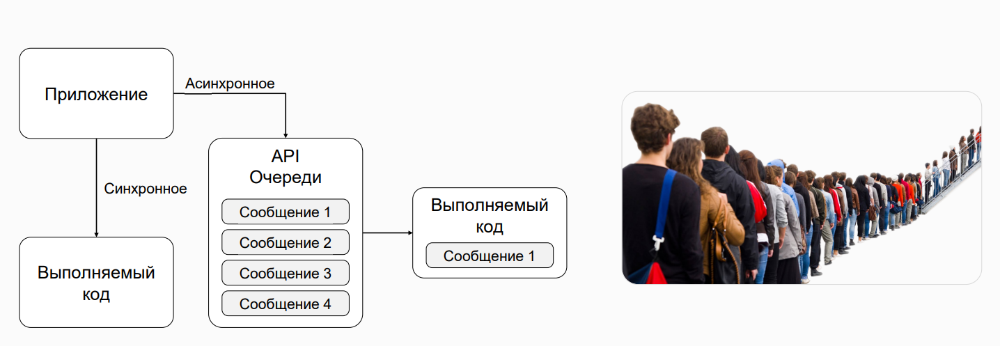
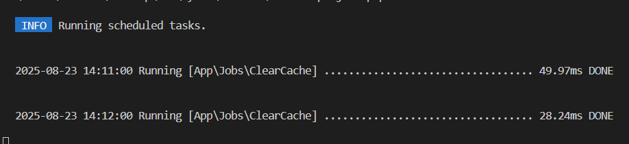

# Laravel Built-in Features

## Queue



Queue is a feature in Laravel that allows you to defer the execution of a task until a later time, typically after the current request has completed. This is useful for tasks that take a long time to complete, such as sending emails or processing large files.

To use the queue feature in Laravel, you need to install the queue driver that you want to use. Laravel provides several queue drivers, including the database driver, the Redis driver, and the Beanstalkd driver. You can install a queue driver by running the following command:

```bash
composer require queue-driver
```

Once you have installed a queue driver, you can use the queue feature in Laravel by creating a job class that implements the `ShouldQueue` interface. The `ShouldQueue` interface is a trait that you can use to mark a class as a queueable job.

```php
class SendEmail implements ShouldQueue
{
    use Dispatchable, InteractsWithQueue, Queueable, SerializesModels;

    protected $email;

    public function __construct($email)
    {
        $this->email = $email;
    }

    public function handle()
    {
        // Send the email
    }
}
```

Once you have created a job class, you can dispatch it to the queue by calling the `dispatch` method on the `Queue` facade. The `dispatch` method takes the job class as its argument and returns a `Job` instance that represents the job.

```php
use App\Jobs\SendEmail;

dispatch(new SendEmail($email));
```

The job will be executed asynchronously, and the `handle` method will be called in a separate process. The job will be removed from the queue once it has been completed.

## Task Scheduler

Task scheduler is a feature in Laravel that allows you to schedule tasks to run at specific intervals, such as every day, every hour, or every minute. This is useful for tasks that need to be executed regularly, such as sending emails or processing large files.

To use the task scheduler feature in Laravel, you need to install the `schedule` package. You can install the package by running the following command:

```bash
composer require laravel/schedule
```

Once you have installed the `schedule` package, you can use the task scheduler feature in Laravel by creating a schedule file in the `app/Console/Kernel.php` file. The schedule file is a PHP file that contains the schedule commands that you want to run.

```php
protected function schedule(Schedule $schedule)
{
    $schedule->command('emails:send')->daily();
}
```

In the above example, the `command` method is used to specify the command that you want to run. The `daily` method is used to specify that the command should be run every day.

You can also use the `everyMinute`, `everyHour`, `everyDay`, `everyWeek`, `everyMonth`, and `everyYear` methods to specify the interval at which the command should be run. For example, the following code will run the `emails:send` command every hour:

```php
$schedule->command('emails:send')->everyHour();
```

You can also use the `cron` method to specify a custom cron expression that defines the interval at which the command should be run. For example, the following code will run the `emails:send` command every 5 minutes:

```php
$schedule->command('emails:send')->cron('*/5 * * * *');
```

Once you have created a schedule file, you can run the `schedule:run` command to execute the scheduled tasks. The `schedule:run` command is a Laravel Artisan command that runs the scheduled tasks defined in the schedule file.

```bash
php artisan schedule:run
```

## localization function

```php
use Illuminate\Support\Facades\Lang;

echo Lang::get('messages.welcome'); // Welcome to Laravel
```

## Notifications

```php
use Illuminate\Notifications\Notification;

class WelcomeNotification extends Notification
{
    public function via($notifiable)
    {
        return ['mail'];
    }

    public function toMail($notifiable)
    {
        return (new MailMessage)
            ->greeting('Hello')
            ->line('Welcome to Laravel')
            ->action('View Documentation', 'https://laravel.com/docs')

            ->line('Thank you for using our application!');
    }
}
```

## Пример

Предположим нам надо выполнять очистку файла логов. Создадим таблицы очереди:

```bash
php artisan queue:table
```

Это создаст миграцию для таблиц jobs и failed_jobs в database/migrations.

Выполним миграции:

```bash
php artisan migrate
```

В файле .env необходимо установить QUEUE_CONNECTION=database и сбросить конфиг:

```bash
php artisan config:clear
```

Создадим Создайте Job ClearCache:

```bash
php artisan make:job ClearCache
```

Реализуем очистку лог-файла в [ClearCache.php](./laravel-project/app/Jobs/ClearCache.php). Для этого в методе handle() добавим очистку storage/logs/laravel.log:

```php
use Illuminate\Support\Facades\File;

public function handle(): void
{

$logFile = storage_path('logs/laravel.log');
if (File::exists($logFile)) {
    try {
        File::put($logFile, '');
    } catch (\Throwable $e) {
    }
}
}
```

Поместим Job в планировщик задач. Откроем [routes/console.php](./laravel-project/routes/console.php) и добавьте там расписание для Job.

```php
Schedule::job(new \App\Jobs\ClearCache())->everyTenMinutes();
```

Запустим задачу:

```bash
php artisan queue:work
```

В другом онке нетрманала также запустим:

```php
php artisan schedule:work
```


