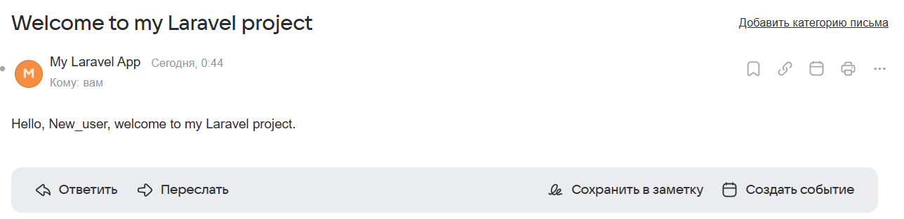
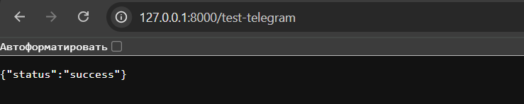
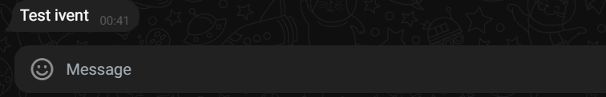
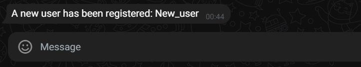

# User authentication

Laravel Breeze is used for user authentication (routes in `routes/auth.php`, controllers in `app/Http/Controllers/Auth`).

Login and registration forms (GET) are rendered via `routes/web.php` with `guest` middleware and return `view('auth.login')` and `view('auth.register')` views.

TwigBridge is used for templates.

The GET `/login` route returns the login page (guest-only), POST `/login` is processed by the Breeze controller (`AuthenticatedSessionController@store`).

If authentication is successful, `$request->authenticate()` is called and the session is regenerated (`$request->session()->regenerate()`).

`redirect()->intended(route('home', absolute: false))` is executed — the user will be returned to the main page (`/`).

[AuthenticatedSessionController](./laravel-project/app/Http/Controllers/Auth/AuthenticatedSessionController.php)

GET `/register` route — returns the registration page (guest-only).

POST `/register` processing is implemented in [RegisteredUserController@store](./laravel-project/app/Http/Controllers/Auth/RegisteredUserController.php).

The following fields are validated: `name`, `email` (unique), `password` (with confirmation and complexity policy).

A user is created (`User::create(...)`) with a hashed password (`Hash::make(...)`).

The `Registered` event is dispatched.

Automatic login is performed: `Auth::login($user)`.

Additionally, project notifications are performed:

- Sending an email “Hello, {{ user.name }}, welcome to my Laravel project.” via Mailable [Welcom](./laravel-project/app/Mail/Welcome.php) ([Twig template](./laravel-project/resources/views/emails/welcome.twig)).

SMTP is specified in `.env`:

```
MAIL_MAILER=smtp
MAIL_HOST=smtp.mail.ru
MAIL_PORT=465
MAIL_USERNAME=your_address@mail.ru
MAIL_PASSWORD=your_mailru_app_password
MAIL_ENCRYPTION=ssl
MAIL_FROM_ADDRESS=your_address@mail.ru
MAIL_FROM_NAME="My Laravel App"
```



- Sending a message to Telegram via `Telegram::sendMessage(...)` about registering a new user.

Package: `irazasyed/telegram-bot-sdk` (installed via `composer require`).

Test route: `GET /test-telegram` — sends a test message.




If you encounter the cURL error 60: SSL certificate problem, try
updating the root certificates (CA) for PHP/cURL:

- download the latest cacert.pem from https://curl.se/ca/cacert.pem, put it, for example, in C:\cacert\cacert.pem.
- in php.ini, write the path:
- curl.cainfo="C:\cacert\cacert.pem"
- openssl.cafile="C:\cacert\cacert.pem"
- restart PHP (restarting the artisan server is not required, but preferred). Check phpinfo(); that the paths were applied.

Update OpenSSL/cURL and/or PHP:
• If you are using an old PHP build, updating often brings fresh CAs.
• Check that there are no conflicting cURL/OpenSSL builds in the PATH.

```
php -i | findstr /I "SSL"
```

If you see an error about the lack of a chat id with the bot, check that the bot has been added to the right chat/channel and has sending rights.

A message about a new user is sent upon registration (the bot must be added to the right chat/channel and have sending rights). Parameters in `.env`:

```
TELEGRAM_BOT_TOKEN=...
TELEGRAM_CHANNEL_ID=@your_channel_or_chat_id
```

- delete the bot's webhook (if any): https://api.telegram.org/bot<TOKEN>/deleteWebhook
- write a new message in the group.
- open: https://api.telegram.org/bot<TOKEN>/getUpdates
- find the latest entry from the group in the response:
  "chat": { "id": -100XXXXXXXXXX, "type": "supergroup", "title": "..." }
- take the id from this object. Put it in TELEGRAM_CHANNEL_ID.

Sometimes the bot has privacy mode enabled, which is why it is “silent”. This usually doesn’t interfere with sending messages, but still:

- open @BotFather → /mybots → select the bot → Bot Settings → Group Privacy → Turn OFF

The notification about new registration is processed in [RegisteredUserController:Store](./laravel-project/app/Http/Controllers/Auth/RegisteredUserController.php).
File: laravel-project/app/Http/Controllers/Auth/RegisteredUserController.php

```php
Telegram::sendMessage([
'chat_id' => env('TELEGRAM_CHANNEL_ID', ''),
'parse_mode' => 'html',
'text' => 'A new user has been registered: ' . e($user->name)
]);
```


