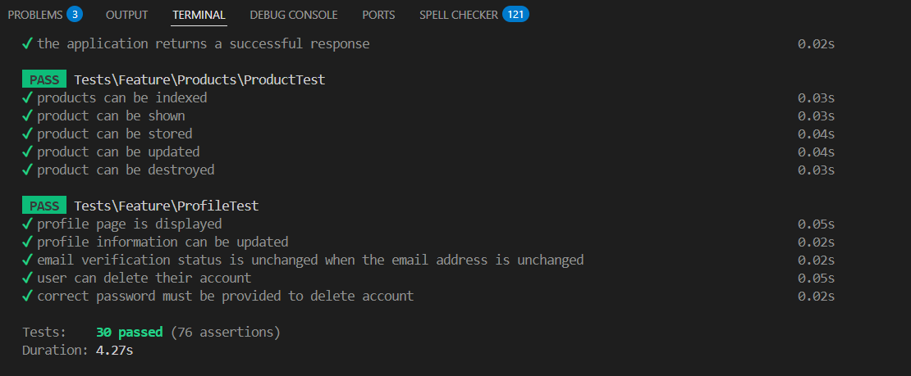
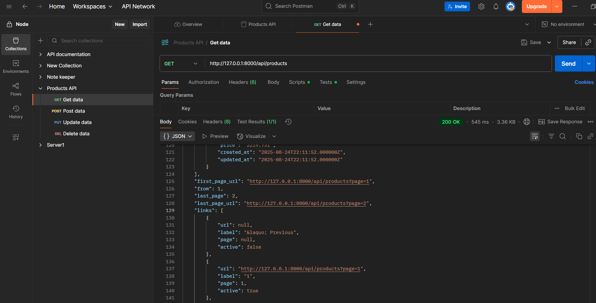
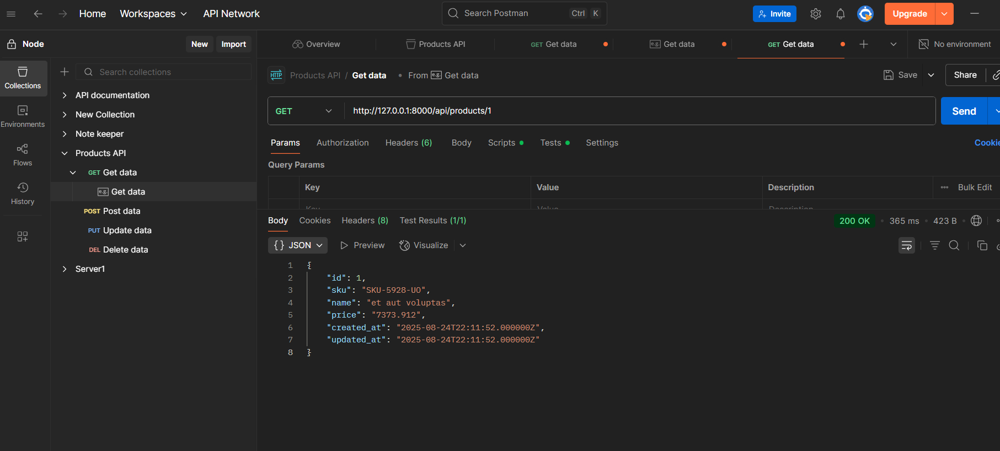
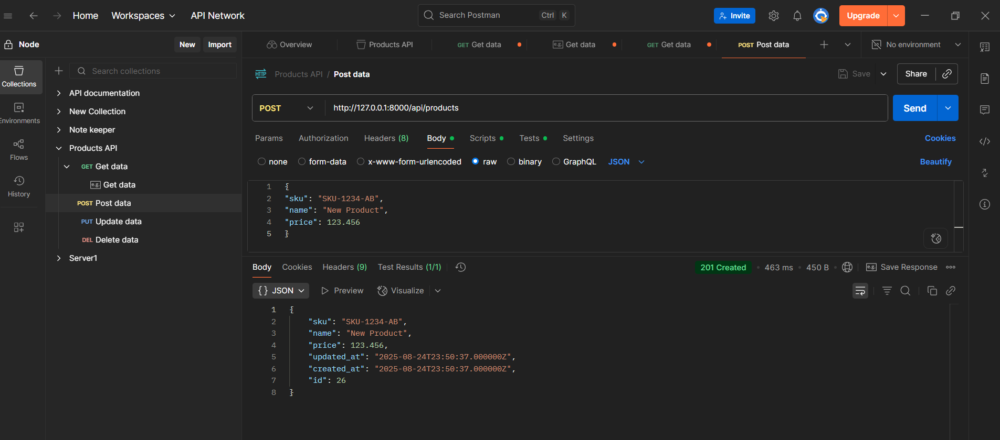
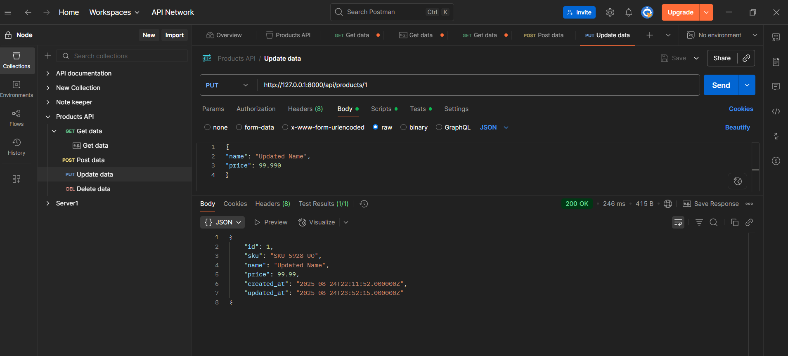
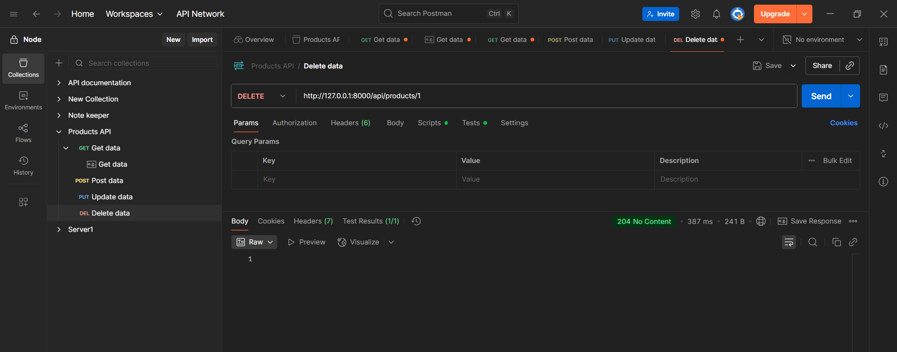

# Testing and debugging Laravel applications

We have implemented a full cycle for the Product entity.

We created the [Product] model (./laravel-project/app/Models/Product.php), prepared the [2025_08_24_000010_create_products_table] migration (./laravel-project/database/migrations/2025_08_24_000010_create_products_table.php), created a seeder to fill the database, added tests for the controller, created routes.

Controller [ProductController](./laravel-project/app/Http/Controllers/ProductController.php) contains methods `index` (pagination, per_page=1..100), `show`, `store` (validation, 201 + Location), `update` (validation, partial), `destroy` (204)

API route - Route::apiResource('products', ProductController::class)

Factory - [ProductFactory](./laravel-project/database/factories/ProductFactory.php)

Seeder - [ProductsSeeder](./laravel-project/database/seeders/ProductsSeeder.php)

Added generation via factory in DatabaseSeeder::run() in [ProductsSeeder](./laravel-project/database/seeders/ProductsSeeder.php)

Tests:

- [ProductTest](./laravel-project/tests/Feature/Products/ProductTest.php)
- Cases: `index`, `show`, `store`, `update`, `destroy`

php artisan test



We check the routes and add postman screenshots:
• GET /api/products

• GET /api/products/{id}

• POST /api/products

•PUT/PATCH /api/products/{id}


• DELETE /api/products/{id}


---

## Running tests on MySQL

We have migrated tests to MySQL to match the production schema.

Created .env.testing with connection values ​​to the test database:

```
APP_ENV=testing
APP_KEY=base64:key
APP_DEBUG=true
CACHE_DRIVER=array
SESSION_DRIVER=array
QUEUE_CONNECTION=sync

DB_CONNECTION=mysql
DB_HOST=127.0.0.1
DB_PORT=3307
DB_DATABASE=laravel_test
DB_USERNAME=your_user
DB_PASSWORD=your_password
```

Created a test database and migrated:

```
CREATE DATABASE laravel_test CHARACTER SET utf8mb4 COLLATE utf8mb4_unicode_ci;
```

The tests use the `RefreshDatabase` trait, which cleans and applies migrations to the test database before execution.

Check that the migrations were applied:

```
php artisan migrate --env=testing
```

I also had to edit phpunit.xml, setting environment variables (section `<php><env .../></php>`), but it is preferable to store them in `.env.testing`.

## Routing in tests

Sometimes in the test environment, api routes were not picked up due to loading peculiarities. We guaranteed the registration of routes:

- The standard `RouteServiceProvider` includes `routes/api.php` under the `/api` prefix and the `api` middleware.

- Additionally, in `AppServiceProvider::boot()` we explicitly register `routes/api.php` and `routes/web.php` to eliminate any discrepancies in the tests.

Route check:

```
php artisan route:list --path=api/products
```

CRUD routes should be visible.

## Email authentication and verification in tests

- After login and registration, a redirect is set to the home page (`route('home')`).
- Authentication tests have been updated to accommodate this behavior (expecting a redirect to `/`).
- For email verification, it is important that the `Illuminate\Auth\Events\Verified` event is dispatched — the tests use `Event::fake` and `Event::assertDispatched`. - We left the standard `VerifyEmailController`, which dispatches the event, and added the middleware `App\Http\Middleware\RedirectVerificationToHome`, which changes the final redirect to the main one (`/?verified=1`). This allows both the event to be caught and the URL to match expectations.

## Troubleshooting

- `could not find driver (sqlite)` — enable `pdo_sqlite` and `sqlite3` in PHP or use MySQL as in `.env.testing`.
- `This database driver does not support dropping foreign keys by name.` — a sign of SQLite. Switch to MySQL for testing.
- `MissingAppKeyException` — add `APP_KEY` to `.env.testing` (copy from `.env` or `php artisan key:generate --env=testing`).

- 404 on `/api/products` — check that the routes are connected: `php artisan route:list --path=api/products`. Make sure that `RouteServiceProvider` and registration in `AppServiceProvider` are active.
- Telegram: `cURL error 60` — install `cacert.pem` and write `curl.cainfo`/`openssl.cafile` in `php.ini`. `chat_id is empty/chat not found` — check `.env` (TELEGRAM_CHANNEL_ID), add the bot to the chat/channel, get `chat_id` via `getUpdates`.

## Products API — formats

- `GET /api/products` — JSON pagination: `data`, `links`, `meta`; parameter `per_page` (1..100)
- `GET /api/products/{id}` — product object `{ id, sku, name, price, ... }`
- `POST /api/products` — validation: `sku` (required|string|unique), `name` (required|string), `price` (required|numeric|min:0)
- `PUT/PATCH /api/products/{id}` — partial update (`sometimes|required`), same rules
- `DELETE /api/products/{id}` — 204 No Content
