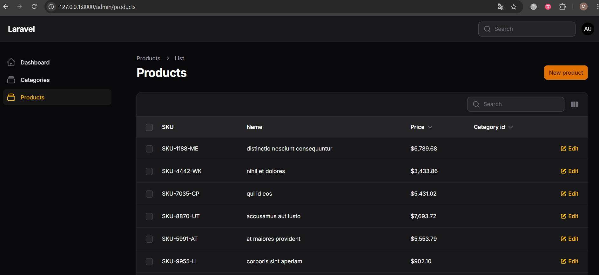

# Admin panel



Migrations:

```
php artisan migrate
```

Fresh Laravel is incompatible with Voyager, so we will use Filament:

### Installing Filament

- PHP requirements: the intl extension is required (and, as a rule, fileinfo, mbstring, gd).
- Enable intl in php.ini (Windows):
- Find the active php.ini: `php --ini`
- You need to uncomment `extension=intl`
- `extension_dir` should point to the folder with the DLL (for example, `C:\\php\\ext`) where `php_intl.dll` should be located
- Check in the terminal: `php -m | findstr /I intl` — should show `intl`
- Installing the package:

```
composer require filament/filament
```

### Creating a panel and resources

- Creating a panel:

```
php artisan make:filament-panel Admin
```

- Path to the panel [AdminPanelProvider](./laravel-project/app/Providers/Filament/AdminPanelProvider.php)
- The provider must contain `->id('admin')` and `->path('admin')`.
- Generating resources:

```
php artisan make:filament-resource Category --generate
php artisan make:filament-resource Product --generate
```

- As the "title attribute" select `name`.
- Model relationships:
- `App\\Models\\Category` — `hasMany(Product::class)`
- `App\\Models\\Product` — `belongsTo(Category::class)` and the `category_id` field in the `products` table (we added it with the `add_category_id_to_products_table` migration).

### Registering a panel

- The [config/filament](./laravel-project/config/filament.php) config must contain (if not, create it manually):

```
'panels' => [
App\\Providers\\Filament\\AdminPanelProvider::class,
],
```

- APP_URL in `.env` must match the address:

```
APP_URL=http://127.0.0.1:8000
```

- Be sure to clear caches and restart the server:

```
php artisan route:clear
php artisan config:clear
php artisan cache:clear
php artisan view:clear
php artisan optimize:clear
php artisan serve
```

### Setting up forms and tables

- Category (form/table):
- Field `name` — required, maxLength 255.
- Table: columns `id`, `name`, `created_at`, `updated_at` (+ sorting/search, Edit/View actions, bulk delete).
- [CategoryForm](./laravel-project/app/Filament/Resources/Categories/Schemas/CategoryForm.php), [CategoriesTable](./laravel-project/app/Filament/Resources/Categories/Tables/CategoriesTable.php).
- Product (form/table):
- Fields: `sku` (required, unique), `name` (required), `price` (numeric, min 0, up to 3 characters), `category_id` (Select → relationship `category.name`, searchable, preload, required).
- Table: `id`, `sku`, `name`, `price` (format `number_format` to 3 characters), `category.name`, `created_at`; filter SelectFilter by category; actions View/Edit/Delete; bulk delete.
- Files: [ProductForm](./laravel-project/app/Filament/Resources/Products/Schemas/ProductForm.php), [ProductsTable](./laravel-project/app/Filament/Resources/Categories/Tables/ProductsTable.php).

### Filament assets (CSS/JS/Fonts) — 404 and how to fix

Eckb in DevTools there is 404 on `/fonts/filament/...` or `/admin/assets/app.css`.

- Check that the panel is registered and the provider is correct (`->id('admin')`, `->path('admin')`).
- Check manually: `http://127.0.0.1:8000/admin/assets/app.css` — should return 200.
- If asset routes are not registered, use asset publishing:

1. In `config/filament.php` set the path:

```
'assets_path' => 'vendor/filament',
```

2. Run:

```
php artisan filament:assets
php artisan optimize:clear
```

Now static files will be served from `public/vendor/filament`, and 404 will disappear.

### Troubleshooting

- The "intl" PHP extension is required to use the [format] method.
- Enable `extension=intl` in php.ini, make sure `php_intl.dll` is present, restart the server.
- 404 on `/admin/assets/app.css` or `/admin/fonts/...`:
- Check panel registration in `config/filament.php` ('panels' => [...]).
- Clear all caches and restart the server.
- Check `route:list --path=admin` manually — asset routes should appear. If not, use asset publishing (`assets_path` + `filament:assets`).
- If the layout is broken:
- Problem with assets (see above) or with APP_URL/base href. Make sure APP_URL matches your URL and caches are cleared.
- Access to admin panel:
- Login as application user, for example `admin@example.com` / `password` (user is created by seeder), or register yourself.
