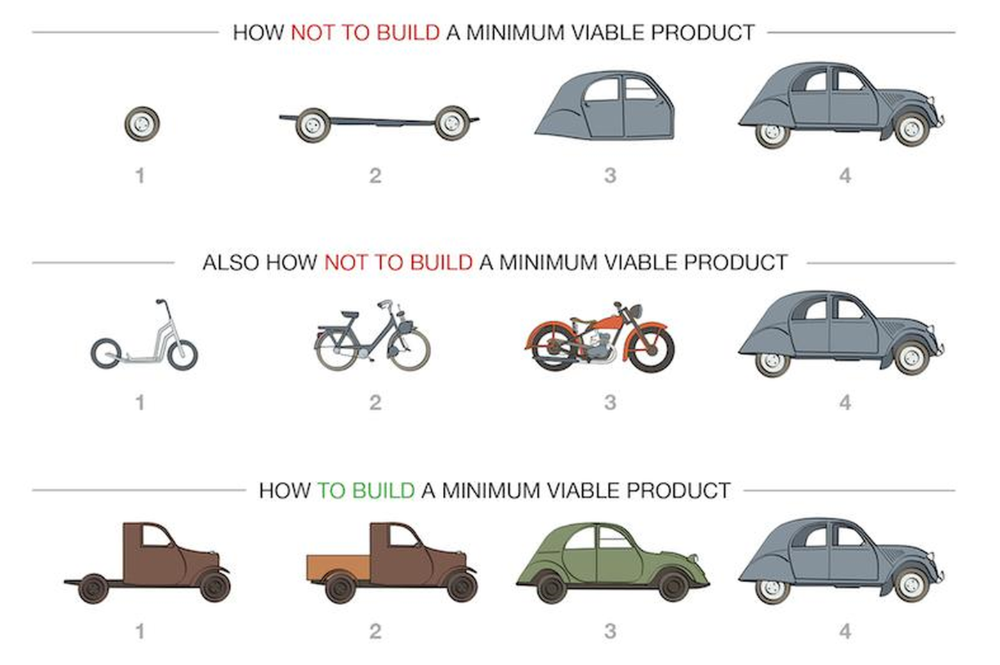

# Application skeleton

In this lesson, we will understand why an application needs to be divided into layers and what techniques are used for this, learn how to use autoloading in the context of OOP and build an application skeleton.

## Separation into layers

An application can develop so dynamically that many new functionalities can appear in it in one working week. At the same time, any application starts with a small development offering minimal functionality (the so-called MVP - minimum viable product).



MVC is a popular architectural pattern for web applications. It divides the application into three layers: Model, View, and Controller.

- Model: The model layer is responsible for the data. It is responsible for the data access and manipulation.
- View: The view layer is responsible for the presentation of the data. It is responsible for the user interface.
- Controller: The controller layer is responsible for the interaction between the model and the view. It is responsible for the business logic.


Separation of MVC layers is a simple way to organize the structure of an application.

Its purpose is to separate business logic from the application's operating technology and
user interface. This separation makes it easier to support, extend, and test.

### Model

The model contains the business logic of the application. If we draw an analogy with our user storage application, the model will be responsible for what user data the application needs to collect, how and where it will be saved.

The model does not have the right to directly interact with the HTTP request. All data that needs to be transferred must be generated in the controller.

Also, the model should not generate HTML or any other output. This is the task of the view layer.

### View

A view is used to create what the user will see. Views can contain HTML markup and basic PHP code inserts: for example: output of variables or a loop for traversing arrays.

A view should not contain complex logical constructs, much less direct descriptions of business or technical logic.

Like models, views do not need to know anything about what kind of request came from the user. This task should be performed by the controller.

At the same time, a view has the right to directly access the properties and methods of controllers or models to obtain the required data package.

As a rule, views have a hierarchical structure, which includes:

- a general template, which contains markup common to all pages;
- partial templates – site blocks with content generated for specific types of pages.

In our storage application, the role of the layer was performed by the code in the template file.

### Controller

The controller is the cornerstone, the glue that connects models, views and other components into a working application. The controller is responsible for processing user requests, but should not contain storage work, HTML markup. The main task of the controller is to accept the request, extract data from it, understand what actions need to be performed according to the application configuration, and pass all the information to the model to execute business logic.

In a good MVC, controllers are small and contain little code.

A sign of bad design will be the anti-pattern Fat Stupid Ugly Controllers (FSUC).

Models will be large, since they contain most of the code

## Code organization

Now we need to organize the code so that all our requests come to one point in the application, get to the controller layer, are passed to the models for execution, and are output as a response using views.

### Entry point

Let's look at the contents of the file [mysite.local.conf](/nginx/hosts/mysite.local.conf)

location directives responsible for processing addresses in Nginx are processed in order, and the first one that matches the address is selected.

Thus, private directives are specified first, and then more general ones.

The first directive is for processing statics. Static should not call PHP:

```
location ~* .(jpg|jpeg|gif|css|png|js|ico|html)$
```

The second directive is the key to implementing Front Controller pattern.

The condition of this directive is:

```
location / {
```

tells us that it will accept absolutely all requests that were not processed by the first directive (the backslash symbol).

In the body of the directive, we say that the address passed to us should be forcibly directed to the index.php file. But how then do we know which address the user wanted to call?

Here we must pay attention to the fact that after index.php there will be an addition in the form of server call parameters:

```
try_files $uri $uri/ /index.php?$query_string;
```

Let's add just one line to index.php:

```
<pre><? var_dump($_SERVER); ?> </pre>
```

If you call the address in the browser:

```
http://localhost/index.php/site/index
```

then we will see that:

- the SCRIPT_FILENAME key will contain index.php, i.e. we have called the expected file;
- the REQUEST_URI key will contain the address called by the user – /controller/action.

This knowledge already allows us to make an agreement regarding the addresses.

Each address will be built according to the following rule:

```
/controller/action/?parameters
```

That is, the first block of the address will always point to the controller that needs to be called. The second - to the method in it. And to transfer additional data, GET variables in the address will be used. For example, if we want to save our user in the storage, the URI will be formed like this:

```
/user/save/?name=Иван&birthday=05-05-1991
```

### Routing

Now we can process routes. As we agreed in the contract above, we need to break down our address and figure out what needs to be called. First, we will learn how to generate the main page of our site.

In order to implement this task, we need to answer several questions.

#### What address will it respond to?

Obviously, the main page in our setup will respond to the address http://mysite.local. But it does not have an address that matches our rule. So, we assume that if we do not have a controller name and action, then we will call the actionIndex method in the future PageController class. That is, this will be the default action.

#### What if the specified address does not have a method or controller associated with it?

For example, the user tries to call the address

```
http://mysite.local/some/save/
```

which we do not have (and it is not clear at all what it can be responsible for). In this case, according to the HTTP specification, we must return a 404 error (Page not found).

Moreover, we will return it even if the controller exists, but it does not have the required action.

Thus, our rule in the implementation area will look like this:

For the address:

```
/user/save/?name=Иван&birthday=05-05-1991
```

the UserController controller should be called, which will have the actionSave method.

We can start describing this behavior rule in classes. But we already know that classes need to be connected somehow.

So, we need to apply the already familiar autoloading here. After all, in our index.php we do not want to connect a ton of files explicitly.

### Autoloading

In OOP, according to PSR conventions, each class is placed in a separate file.

This is regulated by the PSR-1 rule.

As we already know, a class can call instances of other classes. To prevent the code from generating errors, for each called class we would have to include the files where the called classes are described at the beginning of each file.

Generally speaking, PHP allows you to describe an independent autoloader function using spl_autoload_register. This function will contain logic that will search for the file on the disk by its name. But implementing an independent loader is not the best idea, since it is convenient when different projects have the same rules for finding a file on the disk. Then each developer, instead of
reinventing the wheel, will use a common convention.

The problem of loading files is solved by the PSR-4 recommendation. It requires naming the file,
taking the class name without the namespace. In this case, the namespace determines the directory in which our class will be located.

For example, class:

```
GeekBrains\Application\Router
```

will be located in the file:

```
GeekBrains/Application/Router.php
```

In order for this logic to work, we need to modify the already familiar composer.json file, describing the root namespace in it. For this, we will use the already familiar php-gb-cli image, in which we have composer installed. If you suddenly deleted it, here is its Dockerle:

```
FROM php:8.2
VOLUME /data
RUN curl -sS https://getcomposer.org/installer | php -- --install-dir=/usr/local/bin
--lename=composer
ENV COMPOSER_ALLOW_SUPERUSER 1
WORKDIR /data/mysite.local
```

Now, being in the directory of our project, let's execute the command:

```
docker container run -it -v ${pwd}/code:/data/mysite.local/ php-gb-cli composer init
```

It will start creating our project. Let's call it Application 1:

```
Package name (<vendor>/<name>) [root/code]: geekbrains/application1
```

Please note that when calling the container, we specified a volume for it in the code directory. So, if you did everything correctly, then in code you should have the following:

- src directory – it will contain the source codes of our classes
- vendor directory – it will contain the files automatically generated by Composer
- composer.json file.

It will now have the following section:

```
{
  "autoload": {
"psr-4": {
"Geekbrains\\Application1\\": "src/"
}
}
}
```


It says that we have a src directory, which will contain all classes whose namespace starts with Geekbrains\Application1.

The case of writing is important - if you write PSR-4 instead of psr-4, then Composer will not be able to create an autoloader.

The namespace name has two backslashes, as these are the rules of the JSON format (to insert a backslash into a string, you need to write it twice, backslash in JSON is an escape character).

It's time to test the connection of classes with methods. In the index.php file, we'll write the connection of the autoloader:

```
require_once __DIR__. '/vendor/autoload.php';
```

Now let's create our first controller. In the src directory, we'll place the nested Controllers directory, which will contain our PageController in the PageController.php file. According to the PSR-4 rule, we'll set the namespace for it:

```
// file is located in code/src/Controllers/PageController.php
namespace Geekbrains\Application1\Controllers;
```

Let's describe the actionIndex method in it:

```
class PageController {
public function actionIndex() {
echo "Hello";
}
}
```

Now we are ready to call our method. To do this, in index.php we need to specify the namespace we will use:

```
<?php
require_once('./vendor/autoload.php');
use Geekbrains\Application1\Controllers\PageController;
$app = new PageController();
$app->actionIndex();
```

After starting our containers with the command:

```
docker-compose up -d
```

in the browser we can open the address http://mysite.local and see the word Hello there.

But this is only the first step. We want to have a full-fledged application that responds to addresses, and does not require an explicit call to the controller.

Therefore, let's create an [Application](/code/src/Application.php) class in the src directory, which will be responsible for processing requests.

This is the class we will call every time the user calls an address in the browser line.

When calling an address, we need to:

1. Read the address and break it down into call parameters
2. Check that the controller and method are available for calling
3. Create an instance of the controller
4. Call its method
5. Return a response to the user

### Call method

In the Application class, we start by defining properties and constants. Controllers according to our PSR-4 autoloading rule will always be stored in the same namespace. So this is a constant:

```
private const APP_NAMESPACE = 'Geekbrains\Application1\Controllers\\';
```

Now let's create class properties in which we will store the name of the controller that needs to be created and the name of the method that needs to be called.

```
private string $controllerName;
private string $methodName;
```

Now we can begin to describe the logic. For now, it will all fit into one run method:

```
public function run() {
// split the address by the slash character
// define the controller name
// check the controller for existence
// create an instance of the controller if the class exists
// check the method for existence
// call the method if it exists
}
```

We have got an understanding of how the method will be implemented. Let's create it step by step.

You can split a string by characters using the built-in PHP function [explode](https://www.php.net/manual/ru/function.explode.php).

```
$routeArray = explode('/', $_SERVER['REQUEST_URI']);
```

The resulting array will always have an empty element at the zeroth element, since the string in
REQUEST_URI always starts with a slash. The address elements will follow. So, if the user calls the page http://mysite.local/page/index/, the array will contain:

```
0 => ‘’
1 => page
2 => index
```

But the user can set nothing. Then the element with number 1 will be empty. In this case, we must call the default controller (PageController).

```
// define the controller name
if(isset($routeArray[1]) && $routeArray[1] != '') {
$controllerName = $routeArray[1];
}
else{
$controllerName = "page";
}
$this->controllerName = Application::APP_NAMESPACE . ucrst($controllerName) . "Controller";
```

We check if the address specifies a controller.

Next, we get the full class name. It always contains a namespace, which is stored in our constant. Next, the controller name should always be capitalized. This is how the built-in ucsrt function transforms the string. It capitalizes the first letter of the passed string and leaves the rest lowercase.

At the end, we add the standard word Controller.

For the specified address http://mysite.local/page/index/, the following value will be generated:

```
Geekbrains\Application1\Controllers\PageController
```

However, the user can enter anything into the string. So, we need to check for the existence of the class. This can be done using the built-in PHP function class_exists.

```
if(class_exists($this->controllerName)){
}
else {
return "Class does not exist";
}
```

In case the class exists, we should form the method name in a similar way and check for its existence:

```
if(class_exists($this->controllerName)){
// try to call the method
if(isset($routeArray[2]) && $routeArray[2] != '') {
$methodName = $routeArray[2];
}
else {
$methodName = "index";
}
$this->methodName = "action" . ucfirst($methodName);
if(method_exists($this->controllerName, $this->methodName)){
}
else {
return "Method does not exist";
}
}
```

Please note that in method_exists you need to pass the name of the class in which we will look for the method.

Now, if the class and the method in it exist, we can create an instance of the class
and call the desired method on it.

This can be done using the call_user_func_array function:

```
if(method_exists($this->controllerName, $this->methodName)){
$controllerInstance = new $this->controllerName();
return call_user_func_array(
[$controllerInstance, $this->methodName],
[]
);
}
```

The first parameter passed to it is an array containing an instance of the class and the method to be called. The second parameter in the array can be used to pass the call properties. But this is not relevant for us yet.

So, we have a call method:

```
public function run() : string {
$routeArray = explode('/', $_SERVER['REQUEST_URI']);
if(isset($routeArray[1]) && $routeArray[1] != '') {
$controllerName = $routeArray[1];
}
else{
$controllerName = "page";
}
$this->controllerName = Application::APP_NAMESPACE .
ucfirst($controllerName) . "Controller";
if(class_exists($this->controllerName)){
// trying to call the method
if(isset($routeArray[2]) && $routeArray[2] != '') {
$methodName = $routeArray[2];
}
else {
$methodName = "index";
}
$this->methodName = "action" . ucfirst($methodName);
if(method_exists($this->controllerName, $this->methodName)){
$controllerInstance = new $this->controllerName();
return call_user_func_array(
[$controllerInstance, $this->methodName],
[]
);
}
else {
return "Method does not exist";
}
}
else{
return "Class $this->controllerName does not exist";
}
}
```

Now we need to edit the address of the existing files. Let's start with index.php:

```
<?php
require_once('./vendor/autoload.php');
use Geekbrains\Application1\Application;
$app = new Application();
echo $app->run();
```

Now we access our main class and call the main method in it.

The result is displayed on the screen.

Let's edit our PageController a little, replacing echo with return.

```
class PageController {
public function actionIndex() {
return "Hello";
}
}
```

Now our routing framework works as expected. See what happens if you now call the address http://mysite.local/page/index/

## Views

We have already agreed that we will use the presentation layer to write HTML markup and display it on the screen. Of course, you can also write your own logic here, but we will use ready-made libraries for templating (that is, for preparing standard output files).

TWIG is a template engine developed for the PHP programming language.

It provides a simple and flexible way to create and manage web page templates. It is based on the concept of separating application logic and data presentation, which helps to create more modular and easily maintainable code.

TWIG is widely used in popular PHP frameworks, such as Symfony, for rendering web application views.
TWIG can be connected to the application using composer.

TWIG will require additional components for installation and execution, so we will need Docker container extensions that need to be added to Dockerle for cli and fpm:

```
FROM php:8.2-cli
COPY ./php.ini /usr/local/etc/php/conf.d/php-custom.ini
RUN curl -sS https://getcomposer.org/installer | php --
--install-dir=/usr/local/bin --filename=composer
ENV COMPOSER_ALLOW_SUPERUSER 1
RUN apt-get update && apt-get install zip unzip
WORKDIR /data/mysite.local
VOLUME /data/mysite.local
```

After rebuilding the container image, we run the command:

```
docker container run -it -v ${pwd}/code:/data/mysite.local/ php-gb composer
require "twig/twig:^3.0"
```

Our composer.json file will be updated and we will be able to use the template engine functionality. We also need to create a nested cache directory in the code directory, where TWIG will store the generated pages.

We will immediately create our site so that it can have a common style. Therefore, we will need to create

1. The main template - something that will be common to all pages (headers, header)
2. Pluggable templates - something that can be reused

We will store the templates in the src/Views directory.

Let's create our first template there – main.tpl:

```
<!DOCTYPE html>
<html>
<head>
<title>Geekbrains Application 1</title>
</head>
<body>
</body>
</html>
To work with TWIG, it is best for us to create a separate rendering class – Render.
<?php
namespace Geekbrains\Application1;
use Twig\Loader\FilesystemLoader;
use Twig\Environment;
class Render {
private string $viewFolder = '/src/Views/';
private FilesystemLoader $loader;
private Environment $environment;
}
```

In it, we will already store the address of the folder with templates, as well as links to the variables needed for TWIG. Be sure to read the TWIG documentation so that you can refer to it if necessary. Now let's create a simple method for generating our response:

```
public function __construct(){
$this->loader = new FilesystemLoader($_SERVER['DOCUMENT_ROOT'] .
$this->viewFolder);
$this->environment = new Environment($this->loader, [
'cache' => $_SERVER['DOCUMENT_ROOT'].'/cache/',
]);
}
public function renderPage() {
$template = $this->environment->load('main.tpl');
return $template->render(['title' => "Title for my site"]);
}
```

In the constructor, we will create the TWIG environment and configure it.

FilesystemLoader at the specified path will allow loading template files.

Environment will be responsible for the TWIG call itself.

The renderPage method will generate a page based on our base template, passing only the title variable to it for now. We can already access it inside the template itself:

```
<head>
<title>{{ title }}</title>
</head>
```

Variables in TWIG are taken in double curly braces.

Now let's slightly modify our PageController so that it can call TWIG:

```
public function actionIndex() {
$render = new Render();
return $render->renderPage();
}
```

Don't forget to include the required namespace at the beginning of this file

```
use Geekbrains\Application1\Render;
```

If everything is done correctly, then our page http://mysite.local will now be generated from the template.

## Generating page parts

Obviously, each called address will require generating its own part of content. Therefore, we cannot make main.tpl universal. But we can connect other templates to our page.

Let the required template be called inside our page, which will be determined by the call logic.

Let's slightly change our renderPage method in the Render class:

```
public function renderPage(string $contentTemplateName = 'page-index.tpl', array
$templateVariables = []) {
$template = $this->environment->load('main.tpl');
$templateVariables['content_template_name'] = $contentTemplateName;
return $template->render($templateVariables);
}
```

It still includes the main template, but takes as parameters the name of the included template and an array of variables. In the main.tpl template itself, we use the template inclusion structure. It is similar to the built-in file inclusion function in PHP:

```
<body>

</body>
```

Now our main template, setting the layout framework for the entire site, can pass content generation to partial templates.

Let's refine our actionIndex method in PageController:

```
public function actionIndex() {
$render = new Render();
return $render->renderPage('page-index.tpl', ['title' => 'Main
page']);
}
```

Now we can specify which content template to connect.

All that remains is to create the page-index.tpl template:

```
<p>Our first app!</p>
```

If everything is done correctly, the main page will return the expected result.

Note that TWIG caches templates, so changes may not be immediately visible. This is done to speed up the template engine. If you do not see the changes, first clear the cache directory.

## Reproducing the first application in OOP style

Let's reproduce a part of our application from the last lesson. We had a
user storage. Let's learn how to display its contents on the screen.
For this we will need

1. Controller for processing requests to the storage
2. Model for working with the storage
3. Template for outputting data from the storage

Let's create a nested directory storage in the code directory, where we will place our
birthdays.txt file:
Ivan Ivanov, 05-05-1991
Petr Petrov, 07-07-1990

It's time to create our first model. This will be the User model.

What do we know about the user? He has a name and a birthday. These are already properties of
our class:

```
namespace Geekbrains\Application1\Models;
class User {
private string $userName;
private ?int $userBirthday;
}
```

Now we need to implement the connection to the storage. We already have it ready. At the same time,
it does not depend on the User state, so the method will be static.

We will also store the address of our storage in a static property:

```
private static string $storageAddress = '/storage/birthdays.txt';
public static function getAllUsersFromStorage(): array|false {
$address = $_SERVER['DOCUMENT_ROOT'] . User::$storageAddress;
if (file_exists($address) && is_readable($address)) {
$file = fopen($address, "r");
$users = [];
while (!feof($file)) {
$userString = fgets($file);
$userArray = explode(",", $userString);
$user = new User(
$userArray[0]
);
$user->setBirthdayFromString($userArray[1]);
$users[] = $user;
}
fclose($file);
return $users;
}
else {
return false;
}
}
```

In essence, we reused the logic of our application from the 3rd lecture, slightly modifying it. We read line by line. We split each line into two parts by a comma. From each line, we generate an object of the User class.

We put the resulting objects into an array and pass them to return. In case of an error, the method will return false.

Now let's create the UserController controller. It will have only one method.

Its task will be to access the model and obtain the necessary data from it:

```
public function actionIndex() {
$users = User::getAllUsersFromStorage();
$render = new Render();
if(!$users){
return $render->renderPage(
'user-empty.tpl',
[
'title' => 'List of users in storage',
'message' => "List not found"
]);
}
else{
return $render->renderPage(
'user-index.tpl',
[
'title' => 'List of users in storage',
'users' => $users
]);
}
}
```

In case there is an error at the model level, we will call the template user-empty, whereas to display a list of users we would use the user-index template.

The user-empty pattern will be very simple:

```
<p>{{ message }}</p>
Let's take a closer look at user-index.
<p>List of users in storage</p>
<ul id="navigation">

<li>{{ user.getUserName() }}. Birthday: {{ user.getUserBirthday() |
date('d.m.Y') }}</li>

</ul>
```

Here we apply new mechanics.

First, TWIG allows the use of loops. And we need them, since users is an array. Loops and other constructs other than variables are surrounded by curly braces and a percent symbol.

Inside, a simple for loop is implemented, which is very similar to foreach in PHP. Inside each iteration, we call methods for getting data on each element of the array. At the same time, for the birthday, we also apply a filter that turns the timestamp into a human-readable date:

```
user.getUserBirthday() | date('d.m.Y')
```

If we did everything correctly, then at the address http://mysite.local/user/index we will be able to see the data we need.
