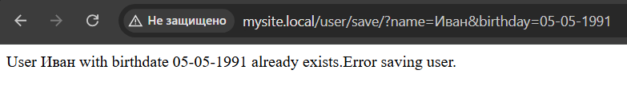

Add style file connections to the template so that you can further refine the system's appearance.

Create three more blocks that are connected to the skeleton - the site header (it will always be the same in style and located at the very top), the site footer (also the same, but at the bottom) and the sidebar (a side column that can be filled with new elements).

Use TWIG to display the current time.

Create error page processing. For example, if the controller is not found, then you need to call a special rendering method that will generate a special error page.

For the error page, generate an HTTP response 404. This can be done using the header function.

Implement the functionality of saving the user in the storage. Saving will occur using a GET request.

/user/save/?name=Иван&birthday=05-05-1991

## Including stylesheets

We need to add links to CSS files in the [template](./code/src/Views/main.twig):

```
<!DOCTYPE html>
<html>
    <head>
        <title>{{ title }}</title>
        <link rel="stylesheet" href="/css/styles.css">
    </head>
    <body>
        
    </body>
</html>
```

In this case, we created a style folder in the root directory of the project in accordance with the server settings: [Style.css](./code/css/style.css).

## Create Plugins

We create three separate templates for the header, footer, and sidebar:

- header.twig

```
<header>
<h1>Site Name</h1>
<nav>
<!-- Navigation -->
</nav>
</header>
```

- footer.twig

```
<footer>
<p>&copy; {{ "now"|date("Y") }} Your site. All rights reserved.</p>
</footer>
```

- sidebar.twig

```
<aside>
<h2>Sidebar</h2>
<ul>
<li>Element 1</li>
<li>Element 2</li>
<li>Element 3</li>
</ul>
</aside>
```

Now we connect these blocks in the main template:

```
<!DOCTYPE html>
<html>
    <head>
        <title>{{ title }}</title>
        <link rel="stylesheet" href="/css/styles.css">
    </head>
    <body>
        

        <main>
            
        </main>

        

        
    </body>
</html>
```

## Displaying the current time using TWIG

Let's use the date filter in TWIG to display the current time:

```
<p>Current time: {{ "now"|date("H:i:s") }}</p>
```

## Handling the error page

Let's create a [ErrorController](./code/src/Controllers/ErrorController.php) to handle errors in the event of a missing method, the name of which is used in the browser address bar.

The error404() method calls the render() method of the [Render class](./code/src/Render.php), passing it the name of the error.twig template and an array with a message variable containing the text "Page not found".

Let's add a method to [Application](./code/src/Application.php) that will handle the error.

Let's add a [template](./code/src/Views/error.twig) for displaying 404 errors.

If the user tries to call a non-existent method, an error template is shown:

## Saving user data using GET requests

The User class has properties for the username and date of birth, as well as a static property for the path to the file where the user data is stored.

The constructor accepts the name and date of birth, initializing the corresponding properties.
The save() method is responsible for saving the user:

- First, it reads existing users from the file.
- Then it checks if a user with the same name and date of birth already exists.
- If the user is not found, it adds the new user to the array and saves the updated array back to the file in JSON format.

UserController class:

- The actionSave() method in the controller extracts the parameters from the GET request, checks if they are empty, and creates a new User object.
- It then calls the save() method to save the user and returns an appropriate success or error message.


