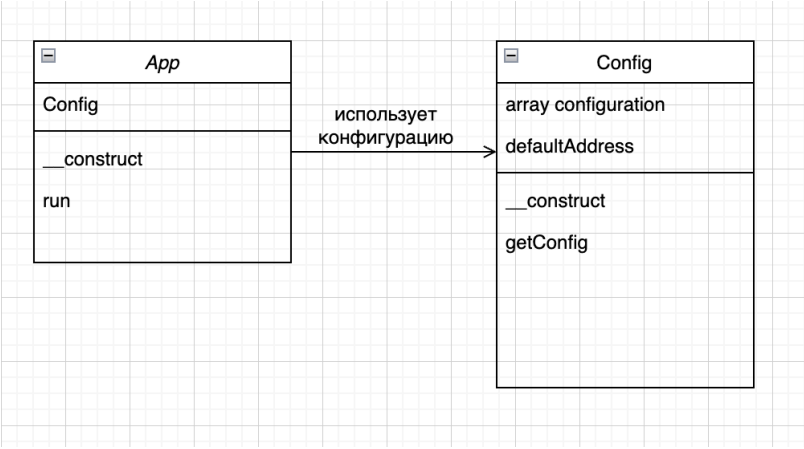

# Object-oriented programming

Classes are the fundamental element of OOP in PHP. Classes define properties and methods that will be used by objects of the class. A class definition starts with the keyword class, followed by the class name and curly brackets that define the properties and methods of the class.

Let's look at an example of a class definition:

```php
class Student {
public string $name;
public int $age;
function __construct($name, $age) {
$this->name = $name;
$this->age = $age;
}
function sayHello(): string {
return "Hi, my name is {$this->name} and I'm {$this->age} years old.";
}
}
```

In this example, we have defined a class called Student with two properties: name and age. The constructor method is used to initialize the properties of the object. The sayHello method is a method that returns a greeting message using the properties of the object.

To create an object of the Student class, we can use the new keyword followed by the class name:

```php
$student = new Student("John", 20);
```

## Properties

Properties are variables that are defined inside a class and can be accessed and modified from outside the class. In PHP, properties are defined using the public access modifier by default. This means that anyone can access and modify the properties of the class. To make a property private, we can use the private access modifier.

To access a dynamic property of an object, use the name of the variable storing the object, followed by an arrow and the name of the property. For example, if you have a "student" object with a "name" property, you can access the property using the expression:

```php
$student->name
```

The values ​​of an object's properties can be changed during program execution, which allows the data for each class instance to be dynamically changed depending on current conditions.

For example, if the student above has a birthday, his age should be increased by 1:

```php
$student->age++;
```

Properties can be static, meaning that they belong to the class, not to its instances. Such properties are marked as static.

From a design perspective, this means that the property will not depend on the personnel.
For example, if we are designing a student class, we can specify that any student has a 50% discount on food in the cafeteria:

```php
class Student {
public string $name;
public int $age;
public static float $discount = 0.5;
function __construct(string $name, int $age) {
$this->name = $name;
$this->age = $age;
}
function sayHello(): string {
return "Hi, my name is {$this->name} and I'm {$this->age} years old.";
}
}
echo Student::$discount;// To access a class property, use the class name followed by a double colon and the property name
```

The types that can be specified can be either scalar (string, number, boolean value) or other classes, since a property of one object may well store a reference to another object.

Dynamic properties define the state of a specific object.

A property can also be marked as "read-only" using the "readonly" keyword. This has been possible since PHP 8.1. Once a property receives a value, it can no longer be redefined.

Such a keyword can be used, for example, for classes that are responsible for transferring data between different storages. That is, once an object is read from one storage, certain of its
properties can no longer be changed until it is transferred to another.

## Methods

Methods are functions that are defined inside a class and are used to manipulate the object's properties. They are defined using the function keyword and can take parameters. The return type of a method is specified after the name of the method.

For example, we can define a method called "sayHello" that takes no parameters and returns a string:

```php
function sayHello(): string {
return "Hi, my name is {$this->name} and I'm {$this->age} years old.";
}
```

Note that, as in the procedural approach, in OOP methods can also have a return type. If a method takes some values ​​as input, then expected types can also be specified for them.

Internally, a dynamic method can access the state of an object and other methods. This is done using the this keyword. When we design a class, we do not know how many objects of this class will be created. But inside a method, we want to be able to work with the state of a specific object. As you can see, in the sayHello method, through this, we access the name and age of a specific
student who called this method. This implementation allows us to make calls of the following type.

```php
$students = [
8
new Student("Olga", 20),
new Student("Ivan", 18)
];
foreach($students as $student) {
$student->sayHello();
}
```

By traversing our students' array, we will be sure that the sayHello method will only access the properties of this object when working with the "Olga" object, and not the properties of the "Ivan" object. That is, we will get the output:

```Terminal
Hi, my name is Olga and I'm 20 years old.
Hi, my name is Ivan and I'm 18 years old.
```

Static methods, like static properties, belong to the class, not to its instances. Such methods are marked as static. Continuing with the example of the discount in the cafeteria, the calculation of the discount for a student could be static. This is how it would look inside the class:

```php
public static function getDiscount(float $mealPrice): float {
return $mealPrice * Student::$discount;
}
```

If the behavior of a method does not depend on the state of the object (the values ​​of the class fields), then such a method is usually declared as static.

Static methods should be used in two cases:

- When the method does not need access to the object state data, since all necessary parameters are specified explicitly;
- When the method only needs access to the static fields of the class.

## Constructors

A constructor is a special method that is called when an object is created. It is used to initialize the object's properties. The constructor is called automatically when an object is created.

For example, we can define a constructor for the Student class:

```php
class Student {
public string $name;
public int $age;
public static float $discount = 0.5;
function __construct(string $name, int $age) {
$this->name = $name;
$this->age = $age;
}
function sayHello(): string {
return "Hi, my name is {$this->name} and I'm {$this->age} years old.";
}
}
```

A constructor is not mandatory for a class. But a constructor is a great help if you need to set the initial state of an object right at the moment of class creation.

Since PHP 8.0, constructor parameters can be used to set the corresponding properties of an object. It is quite common practice to assign the parameters passed to the constructor to the properties of an object, without performing any additional transformations. Defining the class properties in the constructor allows you to significantly reduce the amount of boilerplate code for
this case.

The example above could be rewritten as follows:

```php
class Student {
public string $name;
public int $age;
public static float $discount = 0.5;
function __construct(string $name, int $age) {
$this->name = $name;
$this->age = $age;
}
function sayHello(): string {
return "Hi, my name is {$this->name} and I'm {$this->age} years old.";
}
}

```

## Scopes and access modifiers

In PHP, there are two types of scopes: global scope and local scope. The global scope is the scope in which all variables and functions are defined. The local scope is the scope in which a function is executed.

We saw the static keyword used to mark properties and methods. But note that outside the context of classes, this keyword denotes static scope.

Static scope means that a variable retains its value between function calls.

The access modifiers are used to restrict the access to a variable or a method. There are four access modifiers in PHP: public, private, protected, and internal.

The public access modifier allows access to the variable or method from any part of the program.

The private access modifier allows access to the variable or method from the same class.

The protected access modifier allows access to the variable or method from the same class or from the same class's subclasses.

The internal access modifier is used to access the variable or method from the same file.

## Constants

A constant is a variable that is defined with the const keyword. The value of a constant cannot be changed after its definition.

Such a constant has a global scope within the script. Constants can be defined both in the global scope and within classes.

If a constant is defined in a class, it can be accessed only within this class and its descendants.
This is done using the const keyword

```php
const PI = 3.14;
```

To declare a constant using the define() function, use the following syntax:

```php
define("PI", 3.14);
```

To access a constant defined in a class, you must use the class name and the double colon operator (::):

```php
echo Student::PI;
```

## Implementation of OOP basics in PHP

Encapsulation is a concept in which the data and methods of a class are hidden from the outside world and are only accessible through certain methods of the class. This protects the data from being changed accidentally and makes the code easier to maintain.

Inheritance is a mechanism that allows a new class to be created based on an existing one, borrowing its properties and methods. A class that inherits the properties and methods of another class is called a subclass, and the class from which the properties and methods are inherited is called a superclass.

Polymorphism is the ability of objects to use the same interface for different purposes. This allows you to create flexible code that can work with different types of data and objects without knowing about it in advance. For example, in OOP, polymorphism can manifest itself in method overloading, virtual functions, interfaces, etc.

### Inheritance

In PHP, inheritance allows you to create new classes that can replicate or modify the properties and methods of their parent classes. The class from which properties and methods are inherited is called the parent class or superclass. The class that inherits the properties and methods of another class is called the child class or subclass.

Example:

```php
class Person {
public string $name;
public array $access = [];
13
public function __construct(string $name, array $access = []) {
$this->name = $name;
$this->access = $access;
}
public function checkAccess(string $room) {
return in_array($room, $this->access);
}
}
class Teacher extends Person {
public function __construct(string $name) {
parent::__construct($name, ['classroom', 'teachersroom']);
}
public function guideLecture() {
}
}
class Student extends Person {
public function __construct(string $name) {
parent::__construct($name, ['classroom']);
}
}
$student = new Student("Иван");
$teacher = new Teacher("Ольга");
var_dump($student->checkAccess('teachersroom')); // false
var_dump($teacher->checkAccess('teachersroom')); // true
```

In the example above, the Teacher and Student classes inherit the properties and methods of the Person class. In the child classes, we override the \_\_construct() method so that it only specifies the name and fixes the access level. Then we call the parent constructor via the parent keyword. When the child classes are instantiated, they automatically inherit the checkAccess() method from the Person class, and we can call it as if it were defined in the Teacher or Student class. However, the child class can have its own methods, such as guideLecture in Teacher.

That is, we can partially override the behavior of a method without rewriting it entirely.
Thus, inheritance in PHP allows us to create class hierarchies, where each subsequent class can inherit properties and methods from the previous class and supplement them with its own properties and methods.

But in our example, we started working with accesses. And, as you can see, they have
open (public) access. That is, any user of the code will be able to change the accesses, for example, for a student, at his own discretion. We do not like this very much, since in this case the checkAccess method loses its meaning.

Then our $access field could be made private. The problem here is that in this case it will no longer be inherited by Teacher and Student. And here the third access modifier - protected - will come to our aid. A property or method marked with this modifier will be inherited, but will not be
available outside the class.

Let's edit the Person class to make it safer:

```php
class Person {
protected string $name;
protected array $access = [];
public function __construct(string $name, array $access = []) {
$this->name = $name;
$this->access = $access;
}
public function checkAccess(string $room) {
return in_array($room, $this->access);
}
}
```

Now the $access field is marked as protected, which means that it can be accessed from the same class and from its subclasses. But it cannot be accessed from outside the class.

When inheriting, there may be a situation where we do not want the heirs to override, for example, the behavior of this or that. For such cases, the final keyword is provided. We can mark the checkAccess method with it, so that neither Teacher nor Student can influence its behavior. They will still be able to call it:

```php
public final function checkAccess(string $room) {
return in_array($room, $this->access);
}
```

### Encapsulation

Since we have already become familiar with access modifiers for methods and class properties, we already understand how hiding access to entities is implemented in PHP. But here another problem arises.

If our class has protected or private fields, they may need to be accessed from outside. For example, some other class will want to access the name of a student. Or some class will change fields in another class.

In such a situation, the common practice is to create so-called getter and setter methods. For example, to get a name, which can no longer be simply read directly from an instance of our class, we need to create a method:

```php
public function getName(): string {
return $this->name;
}
```

In the case of setting a protected property, you need to be a little more careful. After all, we must somehow validate the value being created. For example, we will check the specified name against the list so that it does not contain obscene expressions or numbers.

```php
public function setName(string $name) : void {
if($this->validateName($name)){
$this->name = $name;
}
}
private function validateName(string $name) : bool {
// validation logic
}
```

Thus, for protected (or private) properties we can create pairs of methods:

- get – to read the property value;
- set – to set the property value.

### Polymorphism

Polymorphism essentially says that the same line of code can call methods of different classes (after all, with inheritance they can redefine their behavior without changing the name), depending on which object we are working with at the moment.

Let's look at an example where we define the goToLunch() method in the Person class:

```php
class Person {
public string $name;
public array $access = [];
public function goToLunch() {
echo "Going to lunch";
}
}
```

Now let's override this method in the inheriting classes. In Teacher:

```php
class Teacher extends Person {
public function goToLunch() {
echo "Teaching";
}
}
```

And in Student:

```php
class Student extends Person {
public function goToLunch() {
echo "Studying";
}
}
```

### Late static binding

We have already become familiar with the this and parent pointers in OOP. But in addition to them, there are a couple of important keywords. These are self and static.

The self keyword, when accessing a method or property, refers to the class in which it is written.

The static keyword refers to the class in which the method or property was called.

Let's look at an example. Let's say that a static property will be added to our Person family, storing the literary name of the type (for example, for Person - "Person", for Student - "Student"), as well as a method that will identify the object:

```php
protected static string $writableName;
public function whoAmI() : string {
return "Я – " . self::$writableName;
}
```

Now, if we call this method, we will see that both calls returned the string "I am a Person", since the self pointer always refers to the class in which it is written:

```php
$student = new Student("Ivan");
18
$teacher = new Teacher("Olga");
var_dump($student->whoAmI());
var_dump($teacher->whoAmI());
```

And our whoAmI method is defined in Person.

In order for the effect called late static binding to work, we need to replace self with static in the whoAmI method:

```php
public function whoAmI() : string {
return "Я – " . static::$writableName;
}
```

In this case, a similar call will return the following lines:

```Output
I am a Student
I am a Teacher
```

## Abstract classes and interfaces in PHP

In the examples above, we used the Person class, which generalizes the possible specific persons who can use our application - Teacher and Student. Such generalization in programming is called abstraction.

Abstraction is the definition of common entities that can be implemented in different contexts.

In fact, we do not need to directly create instances of the Person class - we are more interested in specific representatives. After all, we want to know whether a particular object can perform a particular action. But generalization helps us not to write the same code several times.

For convenience, abstract classes are created in PHP.

An abstract class is a class that cannot be created explicitly (i.e., using the new keyword). It can also contain both methods with explicit implementation and abstract methods that have no implementation in the class itself, but must be implemented in derived classes.

Abstract classes can be useful when you want to define common properties and methods for a group of classes, but do not want to create instances of this class directly.

Returning to the Person class, we can say that the goToLunch method in it is not really needed from the implementation point of view. Let's modify the code.

Abstract classes, methods, and properties in PHP are marked with the abstract keyword:

```php
abstract class Person {
protected string $name;
protected array $access = [];
public function __construct(string $name, array $access = []) {
$this->name = $name;
$this->access = $access;
}
public function checkAccess(string $room) {
return in_array($room, $this->access);
}
abstract public function goToLunch();
}
```

As you can see, the method no longer has a body. But if we inherit from this class, then in the case that we do not implement this method (that is, do not describe it explicitly), PHP will generate an error that we violate the agreement with the abstract method.

But what if we consider in our application not only Persons, but also, for example, animals? After all, an animal also sometimes wants to go eat.

Inheriting the abstract class Person here is not quite right - after all, we are talking about a person. But we want there to be a contract that guarantees that the class
has a goToLunch method.

Interfaces come in handy for such things.

An interface is a blueprint that describes a set of methods and properties that a class must implement.

An interface defines only the names of the methods, not their implementation. Classes that implement an interface must define an implementation of all the methods defined in the interface.
When naming interfaces, it is worth following the following generally accepted approaches.

1. The interface name must begin with a capital letter, and each subsequent word in the interface name must begin with a capital letter. For example, MyInterface, AnotherInterface.
2. The interface name must be a noun that describes the common set of methods and properties that must be implemented in the class that implements this interface.
3. The interface name must reflect its functional purpose.
   For example, if an interface defines methods for working with a database, its name should contain words related to the database, for example, DatabaseInterface.
4. If an interface defines methods that must be implemented in classes that have a common purpose or purpose, the interface name must reflect that common purpose. For example, if an interface defines methods for working with widgets on a web page, its name may contain the word
   Widget, for example, WidgetInterface.

Examples of valid interface names: Iterator, Countable, DatabaseInterface, WidgetInterface.
We need a contract that says that the class can go get food. Let's call it AbleToLunch:

```php
interface AbleToLunch {
public function goToLunch();
}
```

Now the code for, for example, the Student class will look like this:

```php
class Student implements AbleToLunch {
}
```

Interfaces are useful when we need to ensure that a group of classes has the expected behavior. Thanks to polymorphism, we can check for contract compliance with the same instanceof, but now specifying an interface rather than a specific class. Abstract classes are suitable for defining groups of classes that will have common methods with the same behavior, but each class will have its own implementation of some abstract methods. Thus, abstract classes are more suitable for closely related families of classes.

Interfaces, on the other hand, guarantee that a group of classes will have certain methods, but without implementation aspects. Therefore, interfaces are suitable for groups of classes that are more disparate in their meaning.

## Namespaces

Namespaces are a way to organize classes in PHP. Their purpose is to avoid naming conflicts between classes and to make it easier to manage the code.

Namespaces are defined in PHP using the namespace keyword. For example:

```php
namespace MyNamespace;
class MyClass {}
```

The namespace keyword is followed by the name of the namespace. In this case, it is MyNamespace.

After that, we can use the class in the same way as any other class:

```php
$obj = new MyNamespace\MyClass();
```

The namespace keyword is used to avoid naming conflicts. For example, if we have two classes with the same name, they will be in conflict.

If we want to use a class from a namespace, we need to use the fully qualified name of the class. For example, if we have a class in the MyNamespace namespace, we need to write it as MyNamespace\MyClass.

Namespaces can be nested. For example:

```php
namespace MyNamespace\SubNamespace;
class MyClass {}
```

In this case, we can use the class as follows:

```php
$obj = new MyNamespace\SubNamespace\MyClass();
```

## Principles of writing OOP code

The most common mistake in creating OOP applications when moving from procedural to object code is the widespread use of static methods and, as a consequence, properties. That is, a function:

```php
function readConfig(string $configAddress): array|false{
return parse_ini_file($configAddress, true);
}
```

Simply turns into a method:

```php
public static function readConfig(string $configAddress): array|false{
return parse_ini_file($configAddress, true);
}
```

But what's the problem here? The thing is that we'll have to somehow ensure both the availability of this method throughout the application and the ability to pass the configuration address to it. This is extremely inconvenient, and also violates the encapsulation principle, making the method essentially global.

Working with OOP requires changing your view of code design. Such approaches are well described in Matt Weisfeld's book "Object-Oriented Thinking". But we will try to briefly formulate them for ourselves. Working with the application up to this point, we wrote functions that were executed during the work process. For example, "read configuration", "display all users" and others. We thought in actions. At the same time, the data that was transferred between these actions faded into the background - we were forced to adjust their behavior to the actions being created.

Indeed, it is often faster to create a function than to describe object classes and think through their interaction. But as the volume of code grows, the intricacies of functions become more and more difficult to manage. All this makes our application overcomplicated. However, you shouldn't think that the procedural approach to programming is bad - it has its own areas of application, but PHP is an OOP language, and it is designed to ensure that complex applications are created based on the object paradigm.

When we talk about OOP, we should think in objects. All our programs, which we write using the OOP approach, will consist of objects with their own data and a set of available actions.

Using the example of just one method readConfig, we will now analyze how OOP will help us in building an application in our next lecture.

You probably noticed that the concept of a single entry point to the application is extremely
convenient. Indeed, you should not abandon it.

Let's run the command to create an object autoloader. For now, we will not delve into its work - we will analyze this in the next lecture. It works very similar to the file autoloader, only it will rely on namespaces:

```Terminal
docker run --rm -it -v ${PWD}/php-cli/code:/code php-gb-cli composer init
```

Let's set the name of our application:

```Terminal
app/oop
```

During the work, Composer will create a namespace for us, which will look into the src directory.
Let's create an entry point - the [app_run.php](./php-cli/code/src/app.php) file in the root of the project. For now, we'll only place our autoloader there:

```php
<?php
require __DIR__. '/../vendor/autoload.php';
```

Now in the src folder we will create the App class. According to our settings at the beginning, it will have the App\Oop namespace:

```php
<?php
namespace App\Oop;
class App {
}
```

We want to work with our application. An application is an object. It has properties and behavior. In the simplest version, what are these properties and methods?

1. Configuration property
2. Application startup method

Configuration and access to it can be described directly inside App. But this is wrong. Configuration is also an object! It needs its own class. What will it do? Its main task will be to read files and put them into an array of application settings.

There are more classes, so it would be nice to visualize them using a diagram. You can use a simplified UML notation here.

UML (Unified Modeling Language) is a standardized visual modeling language that is used to describe, visualize, design, and document various aspects of software systems.

It provides a notation for describing classes, objects, components, their interactions, and other aspects of the system.

To describe classes in UML, a class diagram is used, which includes the following main elements:

- Classes: classes are abstractions of objects that have common properties and behavior. They are represented in the class diagram by rectangles containing the class name.
- Attributes: Attributes are properties or data that belong to a class. They are represented inside the class as a list with their names and data types.
- Methods: Methods are the behavior of the class, that is, the operations or functions that the class can perform. They are also represented inside the class and usually have a parameter list and a return type.
- Visibility modifiers: Visibility modifiers determine the accessibility of the attributes and methods of a class to other classes. They can be as follows:
  - '+'' (public) - access is open to everyone.
  - '-' (private) - access is restricted to the current class only.
  - '#' (protected) - access is allowed for the current class and its subclasses.
  - '~' (package) - access is restricted within the current package.
- Relationships between classes: A class diagram also shows the relationships between different classes. The most common relationships are inheritance (an arrow with an empty triangle) and association (a regular arrow). There are also aggregation (an arrow with an empty diamond) and composition (an arrow with a filled diamond).
- Abstract classes and interfaces: UML allows you to specify abstract classes (abstract methods or attributes) and interfaces, which are used to define common behavior and standard contracts.

Let's draw a diagram for our simple application. For this, you can use a browser application:


So, in the configuration object we can store the default configuration address, the configuration itself, and also provide access to the configuration from the outside (so that no one can change it while the application is running).

Now let's describe the [configuration](./php-cli/code/src/Config.php) class logic.

In fact, we have not changed the behavior of getting the configuration much. But it is now stored inside the object. What does this mean? Now we can work with the state!

That is, we create a static property inside App that can be accessed at any point in the application. We do not violate encapsulation, since the application configuration itself is stored inside the class. How can we access it? Let's create a [configuration file](./php-cli/code/config.ini) and a run method inside our application.

Now we can access the configuration at any point in the application as follows:

```php
public function run() {
return App::$config->get()['storage']['address'];
}
```

Run app:

```Terminal
docker run --rm -it -v ${PWD}/php-cli/code:/code php-gb-cli php /code/src/app_run.php
```
