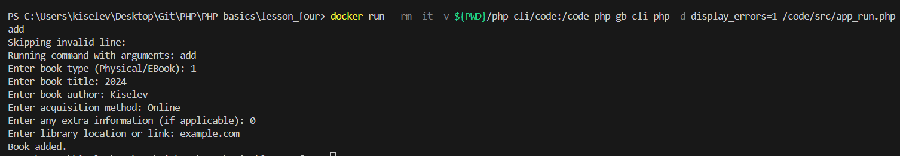

1. Create a class that describes any entity from the library subject area: book, cabinet, room, etc. Describe the properties and behavior of classes. Create heirs of the classes. Create a structure of classes for maintaining a book nomenclature.

A digital book must return a download link, and a physical book must return the address of the library where it can be obtained. All books ultimately generate statistics on the number of readings. What can be put into an abstract class, and what should be inherited?

## Class [Book](./php-cli/code/src/Book.php):

As part of the bookkeeping application, we created a Book class with the following properties and methods:

Properties:

- title: A string that stores the title of the book. This is the main property that identifies the book;
- author: A string that stores the name of the book's author;
- acquisitionMethod: A string that describes the method for acquiring the book, depending on its type;
- readCount: An integer that stores the number of times the book has been acquired.

Properties declared as protected in a class provide flexibility and control in object-oriented programming. They allow you to create safer and more extensible classes while still encapsulating and protecting the internal logic.

Methods:

- construct(string $title, string $author, string $acquisitionMethod): Constructor that initializes the book properties;
- getTitle(): string: Method for getting the title of the book;
- getAuthor(): string: Method for getting the name of the author of the book;
- getAcquisitionMethod(): string: Method for getting the book;
- getReadCount(): int: Method for getting the number of requests to get the book;
- incrementReadCount(): void: Method for incrementing the counter for getting the book.

The Book class contains common properties and methods that will be used by all of its descendants. Declaring Book as an abstract class allows you to define a common interface for all book types.

This prevents the creation of instances of this class, since Book represents the general concept of a book, not a specific instance.

Enforcing mandatory implementation: Abstract methods in the Book class can require that all descendants implement certain methods.

Using an abstract class allows you to easily add new book types in the future.

## Heirs of class and differences

[EBook class](./php-cli/code/src/EBook.php) (Book descendant)

Adds the downloadLink property, which is missing from the parent class.
Implements the getDownloadLink() method, which returns the download link.

[PhysicalBook class](./php-cli/code/src/PhysicalBook.php) (Book descendant)

Adds the location property, which is missing from the parent class.
Implements the getLocation() method, which returns the location of the physical book.

Both inheritor classes have getters and setters for working with books.

In addition, we created a [Library class](./php-cli/code/src/Library.php) that uses the following methods to view, add, remove, and get a book with an incrementing counter.

It also loads library information from the libraries.csv file, stores each library name and URL in the $libraries associative array, creates a PhysicalBook or EBook instance depending on the type and stores it in the $books array, finds a book by title, stores the current books array in a CSV file ([Books.csv](./php-cli/code/books.csv)), prompts the user for new book information and adds it to the library.

The loadConfig() method is used to set the address of the data file, which is responsible for loading the configuration from the config.ini file. It provides encapsulation of the configuration loading logic and error handling, which makes the code more reliable and easier to configure.

The [App class](./php-cli/code/src/App.php) serves as the main interface for interacting with the library and managing books. It encapsulates the logic for executing commands and delegates the actual operations to the Library class. This allows for separation of responsibilities between classes and makes the code more organized and maintainable.

The [app_run](./php-cli/code/src/app_run.php) file is the entry point of the application. It contains code that initializes the necessary classes and starts the main process.

It accepts command line arguments that specify what operation to perform (e.g. view, add, delete, get).

Depending on the arguments passed, it calls the runCommand() method of the App class, which processes the commands and delegates execution to the corresponding methods of the Library class.

After executing the commands, it displays the results on the screen, e.g. a list of books, confirmation of adding or deleting a book.

In the future, we can expand the capabilities of working with the library, for example, a checkout counter can be used depending on the type of book. In each book class, a property can be added to account for the number of times the book was checked out (for electronic form, this can be the number of copies, for paper - the number of readings). This can be implemented as a static variable or as a regular property, depending on whether the counter needs to be stored for each copy of the book or for all copies of one type. We can also add different types of books, for example, in audio format.

To run the application, we will create an image and launch a container in which we will test the commands:

```
docker build -t php-gb-cli php-cli/
docker run --rm -it -v ${PWD}/php-cli/code:/code php-gb-cli php -d display_errors=1 /code/src/app_run.php view
```


```
docker run --rm -it -v ${PWD}/php-cli/code:/code php-gb-cli php -d display_errors=1 /code/src/app_run.php get
```


```
docker run --rm -it -v ${PWD}/php-cli/code:/code php-gb-cli php -d display_errors=1 /code/src/app_run.php add
```



2. Given code:

```
class A {
public function foo() {
static $x = 0;
echo ++$x;
}
}
$a1 = new A();
$a2 = new A();
$a1->foo();
$a2->foo();
$a1->foo();
$a2->foo();
```

What will it print at each step? Why?

Answer: The static variable $x is initialized to 0. Then ++$x is executed, which increments $x to 1. Further initialization increments the variable by one.

Output: 1 2 3 4

Let's change step 5 a little

```
class A {
public function foo() {
static $x = 0;
echo ++$x;
}
}
class B extends A {
}
$a1 = new A();
$b1 = new B();
$a1->foo();
$b1->foo();
$a1->foo();
$b1->foo();
```

What will it print now?

Answer: The static variable $x in the foo() method belongs to class A, not to instances of the class. This means that all instances of class A and its descendants (in this case, an instance of class B) share the same value of the static variable $x.

So, even though the foo() method is called on both instance A and instance B, they both operate on the same static variable $x, which results in the same output as in the previous example.
