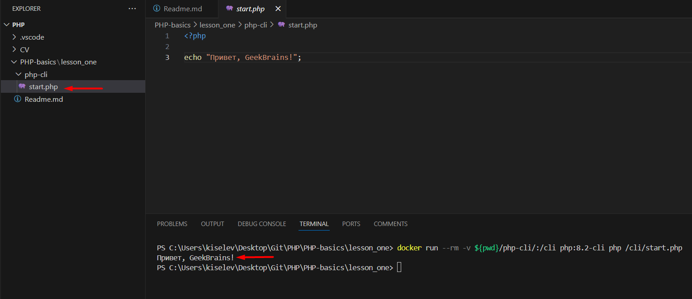
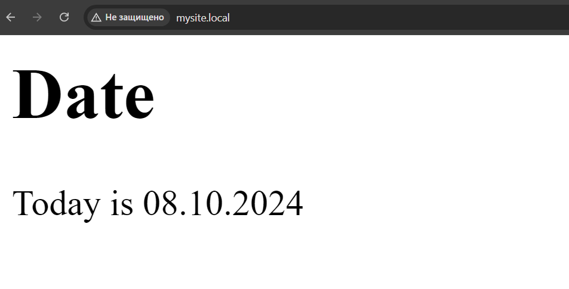

# PHP-basics

## PHP on the command line

The simplest way PHP works is through the CLI (Command Line Interface).

In this mode, we will not be able to serve requests from the browser, but we can already write some logic. We will need scripts of this type to solve routine tasks that do not require user participation. For example, if you want to send a constructed message to the Telegram channel chat once a day.

To start, we will create a new file in our code editor, which we will call start.php the following content:

```php
<?php
echo "Hello, World!";
```

<?php -> This is a PHP script. It is a file that contains PHP code.?>

echo "Hello, World!"; -> This is a PHP command. It is used to output a string.

The result of the script will be: Hello, World!

; - The semicolon at the end of the line is optional.

In the directory of our project, we will create a php-cli folder where we will place the script code
start.php . Let's run the code in the container with the following command:

```Terminal
docker run --rm -v ${pwd}/php-cli/:/cli php:8.2-cli php /cli/start.php
```

Don't forget that VSCode must be run as an administrator.

In order for everything to work out, you need to install Docker, download the PHP interpreter and specify the path to it in variable environments.

Note that the script in this example runs from the root directory of the project, which we access via ${pwd}.

The curly brackets here {} are a reference to the pwd command in PowerShell, which returns us the address of the current directory.

If you run the command via Linux, replace the curly brackets with round ones.

As a result, after building and launching the container, we will see the answer in the console:
Hello, GeekBrains!

After executing the script, the container will stop and be deleted.



## PHP in the browser

We have learned how to run a simple script, but how to ensure the operation of the whole site?

Here the cli is not enough. Let's remember how a website works using the HTTP protocol.

The HTTP request from the browser to the server is as follows:

1. The user enters the website address in the browser's address bar, then the browser creates an HTTP request.
2. An HTTP request is a set of textual information containing information about which page to get.
   This file consists of three main parts
   a. The query string contains the request method (GET, POST, PUT, etc.), URI (Uniform Resource Identifier) and the HTTP protocol version.
   b. Headers contain additional information about the request, such as browser type and version, content type, etc.
   c. The request body contains additional information, such as form parameters when using the POST method.
3. The browser sends an HTTP request to the server specified in the URI.
4. The server receives the HTTP request and starts processing it. The server can respond to requests as a static file, a dynamic file, or a script.
5. If the requested page is static (simple HTML code, for example), the server sends it back to the browser in the form of an HTTP response, which contains the status code, headers and the body of the response.
6. If the requested page is dynamic (and this is just the case with PHP), the server processes the request, passes the data generation to the interpreter and waits for the result. The server then sends this page back to the browser as an HTTP response.
7. The browser receives an HTTP response and processes it. If the response contains data in the form of HTML, CSS and JavaScript, the browser displays the page on the screen.

Thus, in addition to PHP, we need some kind of web server that will accept connections at the entrance.

The most popular and relevant at the moment is the Nginx web server - it will accept HTTP requests, determine whether they are dynamic or static, and then transmit dynamic requests to FPM.

The fact is that Nginx itself is not able to understand code in PHP or any other language – it has a different task.

The interpreter will no longer be a cli container, but a special handler that interacts with Nginx via the FastCGI protocol. This will be a PHP-FPM FastCGI process manager for PHP. It allows you to run and manage multiple PHP-FPM processes as background processes processing web server requests.

FastCGI (Fast Common Gateway Interface) is an interaction protocol between a web server and web applications that allows the server to access external processes running scripts on the server and receive responses from them.

FastCGI provides a structured exchange of data and commands between the web server and an external process in the format of records, which can contain various types of data such as request parameters, environment variables, request data, etc. The protocol also provides mechanisms for managing the state of the FastCGI process, such as managing process pools, restarting processes, etc. etc.

PHP-FPM (PHP FastCGI Process Manager) is a PHP component that provides a FastCGI implementation for PHP scripts. It is a separate process that executes PHP scripts and interacts with the web server via the FastCGI protocol. PHP-FPM offers a number of options for configuring and managing PHP processes, such as managing PHP process pools, regulating the number of PHP workflows, and managing resources.

Using PHP-FPM, you can manage and configure the operation of PHP processes by setting parameters such as:

- Number of processes
- Lifetime of processes
- Maximum memory size, etc.

This allows you to improve the performance and stability of the web server under heavy loads.

Based on the understanding of containers, we will need two containers that will work all the time. This means that we will use docker-compose.

We will create a [docker-compose.yml](./php-fpm/docker-compose.yaml) file in the php-fpm directory.

We will build a site responding to the name mysite.local.

Of course, there is no such domain on the global network, so we need to add the appropriate entry to the hosts file – this is a local file on the computer that is used to map IP addresses and domain names. The location of the hosts file may differ on different operating systems.

Here is the location of the hosts file in some popular operating systems:

- In the Windows operating system, the hosts file is usually located along the path
  C:\Windows\System32\drivers\etc\hosts.
- In the macOS operating system, the hosts file is located in the folder
  /private/etc/hosts.
- On the Linux operating system, the hosts file is located in the /etc/hosts folder

Let's add an entry to the end of this file:

```
127.0.0.1 mysite.local
```

If we look closely at docker-compose, we will see that we will need to create three additional folders:

- code is the folder for the volume that will be pushed into containers.
- fpm is a Dockerfile folder for PHP-FPM.
- nginx is the folder for the Dockerfile and nginx configuration.

Let's look at the Nginx. It contains instructions that tell how the web server should process
a particular URL that the request came from.

```
server configuration {

    # specify the 80 port for
    the listen 80 connection;

    # you need to specify which domain name our config belongs to
    server_name mysite.local;

    # setting the root directory
    root /data/mysite.local;

    # the start file
    index index.php index.html;

    # when accessing static files, logs are not needed, as well as accessing fpm
    # http://mysite.local/static/some.png
    location ~* .(jpg|jpeg|gif|css|png|js|ico|html)$ {
        access_log off;
        expires max;
    }

    # remember about a single access point
    # all requests are wrapped in the root directory on index.php
    location / {
        try_files $uri $uri/ /index.php?$query_string;
    }

    # and finally, the rule for accessing php-fpm
    location ~* .php$ {
        try_files $uri = 404;
        fastcgi_split_path_info ^(.+.php)(/.+)$;
        fastcgi_pass app:9000;
        #fastcgi_pass unix:/var/run/php-fpm.sock;
        fastcgi_index index.php;
        fastcgi_param SCRIPT_FILENAME $document_root$fastcgi_script_name;
        include fastcgi_params;
    }

}
```

Now we can launch our containers with the command:

```Terminal
docker-compose up
```

If everything is done correctly, then in the browser at http://mysite.local we will see the contents of our website, which will display full information about which version of PHP we are using.


### Sample

We have created a new directory with an example "Sample". We put the page template in this directory.

Let's stop the current containers and delete them using the following commands:

```Terminal
docker stop $(docker ps -aq)
docker rm $(docker ps -aq)
```

Now let's rebuild our containers and run the template:

```Terminal
docker-compose up
```

Open our template: http://mysite.local


The template already has the variables title and date, which are displayed on the site.

## Programming

We have already written a couple of simple scripts that can display something on the screen both in the console and in the browser.

Now let's try to write something more conscious to deal with variables and types in PHP!

Let's try to integrate into the HTML code using PHP to make our site dynamic.

Please note that it is bad form to place complex PHP logic directly in the layout files. This prevents you from reading the code. But for now, at the start, we will accept this assumption.

Now let's add information about the name of our site and the current date to the site header.
At the beginning of the file, add the following code:

```php
<?php
$title = "<em>Geek</em>Brains";
$today = date("d.m.Y");
?>
```



Here we have declared two variables: title and today are two string variables that we will refer to later.

In PHP, a variable is declared with a dollar sign ($)

This is followed by the variable name, which can consist of letters, numbers, and an underscore, but must not start with a digit!

The assignment of a variable value is performed by the assignment operator (=).

For example:

```php
$myVariable = "Hello World!";
```

We declare the title variable explicitly by manually specifying the string to be accessed.
The today variable is generated using the date function built into PHP. This function outputs the date in the specified format. In our case, it will be the format "day.month. year".

PHP has a dynamic type system, which means that the type of a variable is determined automatically during program execution and can be changed during interpretation. This differs from statically typed
programming languages such as Java or C++, where the type of a variable is determined at compile time. That is, a variable in which, for example, a string was saved can place an integer value instead of it at runtime.

In order for value types to transform correctly, PHP has a type conversion mechanism. Type conversion in PHP is the process of changing the type of a variable to another type. PHP automatically casts types when performing operations, but sometimes explicit type casting is required.

There are two types of type conversion in PHP:

- Explicit;
- implicit.

### Implicit casting

Implicit type conversion occurs automatically when PHP tries to perform an operation on variables of different types.

For example, if a string variable, that is, a string, actually contains a number, PHP automatically converts it to a number to perform a mathematical operation.

```php
$number = 5;
$string = "10";
$sum = $number + $string; // result - 15
```

Explicit type conversion occurs when using special functions to cast variables to the desired type.
For example, the intval() function converts a variable to an integer type.

```php
$float = 2.5;
$int = intval($float); // $int = 2
```

```php
$string = "5";
$int = (int)$string; // $int = 5
```

You need to be prepared for automatic type conversion, since, for example, when converting float to int, the precision of the number is lost.

Therefore, think about what types your code will operate with.

During debugging, the actual type of the variable can be seen by calling the var_dump function

```php
$float = 2.5;
var_dump($float);
```

But please note that this is solely a debugging feature. And it has no place in the work system.

### Types of variables

PHP has three types of variables:

- Integer;
- String;
- Boolean;
- Array;
- Object;
- Resource;
- NULL;
- Unknown.
