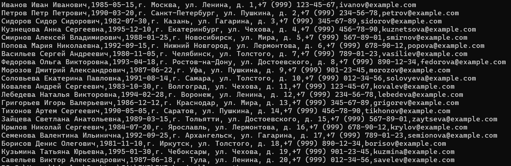
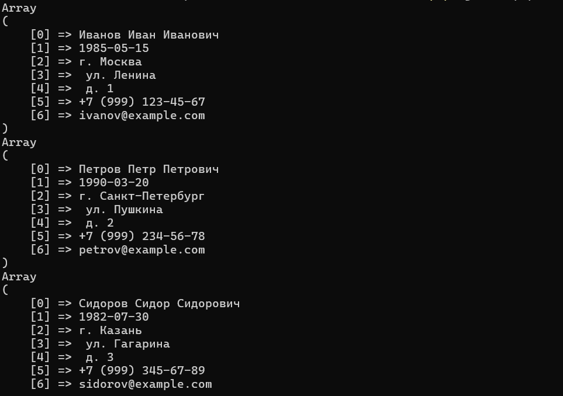
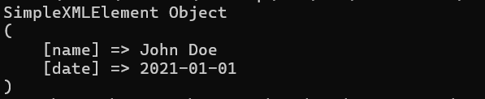

# Files, code connection, Composer

As you may remember, PHP is an interpreted programming language that runs on the server. A very important aspect is that in most cases, a PHP script always “dies” at the end.

This means that the script works according to the following algorithm:

1. Launching the interpreter and loading modules.
2. Initializing variables.
3. Launching functions and executing logic.
4. Terminating work and destroying data stored in memory.

Thus, between calls, for example, of different pages in the browser, saving any data is a task that we have yet to solve.

For example, if we want to remember the user's data (name, date of birth) between calls to congratulate him on his birthday once a year, we will have to place them somewhere on the server in long-term storage (on the hard drive).

The simplest solution for saving state between script runs is to save the data in a file on the server. This can be a simple text file or a file storing data in some structured format (for example, CSV - comma separated values). In such a file, data is stored line by line, where each line is a data tuple. In programming, a tuple is a set of elements of different types belonging to the same entity.

## Storing data in files

### Reading from files

PHP provides several ways to read a file. The simplest and most common way is to use the file_get_contents() function.

It allows you to read the contents of a file as a string.

We have a file [file.csv](file.csv), which stores data. Let's try to output it to the console by writing a simple script [file-read.php](file-read.php).

Let's run the script from the directory:

```Terminal
php file-read.php
```

The output will be:


But there is a problem here! It is that the file may be very large. When reading such a file, PHP will be forced to load all its contents into the system's RAM.

This is a very expensive operation, and there may simply not be enough memory. Therefore, in
the case where the file size is not known in advance, it is better to use lower-level reading functions.

The main idea here will be that a small piece of data is unloaded into memory, processed, and then the next piece is loaded in its place.

These are the functions:

- fopen(),
- fread(),
- fclose().

The fopen() function opens a file, storing the result of opening in a variable of type Resource.

The "Resource" type in PHP is a special data type that is used to represent external data sources, such as files, databases, server connections, etc. This data type is not a primitive type in PHP, it stores a reference to an external resource that is managed inside a PHP extension.

When you create a connection to a file, PHP returns a reference to this resource as a "Resource" type. This means that this resource is not a simple value that can be copied or assigned to another variable, but is an external resource that is managed inside a PHP extension.

When you are done with the resource, you should free it to prevent memory leaks and other problems (such as exceeding the limit of connections to the external data source). Typically, a PHP extension function is used for this, such as fclose() to close a file or mysqli_close() to close a database connection.

Next, you need to read the data from the file that we saved the reference to. This is done by the fread() function - it is used to read data from an open file in binary mode. This function has the following syntax:

```php
fread ( resource $handle , int $length ) : string
```

Where:

- $handle is an open file handle returned by the fopen() function.
- $length is the number of bytes to read from the file.

The fread() function reads the number of bytes specified in $length from the file pointed to by $handle - this is the same Resource that we got when opening via fopen. As a result, the function returns the received data as a string. If there are less than $length bytes left until the end of the file, the function will read only the remaining part of the file.

For example, to read the first 100 bytes from the file "example.txt", you can use the following code:

```php
$file = fopen("file.csv", "rb");
$data = fread($file, 100);
fclose($file);
```

In this example, we open the file "file.csv" in binary mode ("rb" mode), read the first 100 bytes using the fread() function, save them in the $data variable, and then close the file using the fclose() function.

fopen can have several modes of operation. For example, a file can be opened for writing, which we will consider a little later.

Note that the fread() function in this example reads data from the file in binary mode, meaning it does not handle line breaks or other special characters.

The fclose() function closes the file. This must be done, because if the file is not closed, it may not be available for reading by other users.

But 100 bytes may not be enough for us - the file may be larger!

Therefore, we must read the file until we reach its end. And here the already familiar while loop will come in handy.

Let's modify our code and create a separate script [fread](./fread.php)

Please note that here we begin to apply processing of non-standard situations in the work of scripts. This is necessary so that, in case of errors, our users can receive more informative messages.

In our case, we will handle the situation when the file does not exist (for example, the address is incorrect).

In this case, our program will issue a Warning that the file could not be opened because it does not exist. And then our error will appear on the screen.

It will look like this:

```Terminal
Warning: fopen(./file.csv): Failed to open stream: No such file or directory in C:\...\fread.php on line 2
The file cannot be opened or does not exist.
```

So we can leave only our message. In the simplest version,
we need to check whether the file we are looking for exists at all. This can be done
using file_exists. We also need to make sure that PHP can read the file - this is the function is_readable.

Now we can modify our code so that it outputs only the error message we want: [fexists](./fexists.php).

### Writing to files

Now we need to learn how to write to a file in order to replenish our data.

Along with file_get_contents, there is a wrapper function file_put_contents(). It
writes data to a file, creating it if necessary: [file-write](./file-write.php).

But, as you remember, the size of the data being written is not always known in advance.

Therefore, you can use an analogue of fread - the fwrite function. It writes data to an open file. And here it is important to pay attention to several aspects.

We already know how to check the existence of a file and its readability. Along with this, it is possible to check the rights to write to a file. This is done by the is_writable function.

In addition, there are different modes for writing to a file. We read from a file by opening it
in the "r" mode - reading. To write, we will need to select one of the modes of adding information:

- 'w' - open for writing only, start writing from the beginning of the file and delete its contents. If the file does not exist, try to create it.
- 'w+' - similar to w, but you can also read from the file.
- 'a' - open for writing only, append data to the end of the file without deleting its contents. If the file does not exist, try to create it.
- 'a+' – like 'a', but the file will also be readable.
- 'x' – create and open a file for writing only, starting writing from a clean file. If the file already exists, the fopen() call will fail, returning false.
- 'x+' – like 'x', but the file will also be readable.
- 'c' – open a file for writing only. If the file does not exist, it is created. If it does exist, it is not truncated (unlike 'w'), and the call to this function does not fail (as with 'x'). The file pointer is located at the beginning of the file.
- 'c+' – like 'c', but the file will also be readable.

If we collect data from users for further storage, in order to congratulate them on their birthday, we will need to append data to the end of the file, so as not to destroy the existing data. Therefore, the mode - 'a' will suit us: [fwrite](./fwrite.php).

In this example, we open a file for writing, place the string we need in the file, and close the file using the fclose() function.

However, our script only places the same string. Let's teach it to request data from the user.
We will need a function for reading user input into the console - readline.

It displays the text passed to it on the screen, and in response returns the data entered by the user: [readline](./readline.php).

### File formats

PHP supports many file formats:

- CSV files
- XML files
- JSON files
- YAML files
- HTML files
- PDF files
- Images
- Audio
- Video
- Archives
- Databases
- Other file formats

Depending on which format is used, there are different ways to read and write files.

For example, if you are working with a CSV file, you can use the fgetcsv() function to read from the file as an array: [fgetcsv](./fgetcsv.php).



#### Xml format

XML format is a more complex structure. It is similar to HTML. It stands for extended markup language. It can store data with tags.

For example, our birthday file in XML will look like this:

```xml
<birthday>
    <name>Василий Васильев</name>
    <date>05-06-1992</date>
</birthday>
```

If you are working with an XML file, you can use SimpleXML or DOM functions to read and write files: [printxml](./printxml.php).



In this example, we use the simplexml_load_file() function to load the contents of a file into a SimpleXMLElement object. We then print the contents of the SimpleXMLElement object using the print_r() function.

We use objects that we will learn about later in the course, so that you can continue to work with this library of functions.

#### Json format

JSON (JavaScript Object Notation) is a lightweight data-interchange format based on JavaScript object syntax. It is used to represent data as text that can be easily read and understood by other programs.

JSON consists of key-value pairs that are grouped into objects or arrays. Keys must be strings, and values ​​can be any valid data type, including other objects or arrays. Values ​​are separated by a comma, and key-value pairs are separated by a colon.

For example, our birthday file in JSON will look like this:

```json
[
{ "name": "Василий Васильев", "birthday": "05-06-1992"}
{ "name": "Иван Иванов", "birthday": "05-12-1993"}
]
```

JSON is often used to transfer data between the client and server sides of web applications, as well as to exchange data between different applications and services. It is lightweight, readable, and easy to parse, making it very popular among developers. So we will come back to it more than once.

If you are working with a JSON file, you can use the json_encode() and json_decode() functions to convert data to and from JSON format: [json-encode](./data.json).

#### Yaml format

YAML (YAML Ain't Markup Language) is a human-friendly data serialization language. It is a human-readable and human-editable data format. It is similar to JSON, but it is more compact and easier to read. It is used to store data in a human-readable format.

For example, our birthday file in YAML will look like this:

```yaml
name: Василий Васильев
birthday: 05-06-1992
```

YAML is often used to store configuration files, as it is easy to read and edit.

If you are working with a YAML file, you can use the yaml_parse() and yaml_emit() functions to convert data to and from YAML format.

#### Html format

HTML (HyperText Markup Language) is a markup language used to create web pages. It is used to structure the content of web pages.

For example, our birthday file in HTML will look like this:

```html
<html>
  <body>
    <h1>Василий Васильев</h1>
    <p>05-06-1992</p>
  </body>
</html>
```

HTML is often used to create web pages, as it is easy to read and edit.

If you are working with an HTML file, you can use the file_get_contents() function to read the contents of the file.

## Files with code

Up to this point, we have been working in the most primitive paradigm, where all the necessary code is stored in one file. But in real systems, the volume of code is measured in hundreds of thousands of lines. And storing such code in one file and without a separation system is difficult and inconvenient. Moreover, the code will be supported by many engineers. Therefore, the generally accepted practice is to arrange the code into files in accordance with the meaning of the code.

So far, we have only worked with elementary constructs - functions. But with them, we can already separate our code. A little later, we will get acquainted with more complex concepts of code organization.

For example, let's combine the functionality of our user storage into a single application that can then be fully used.

Professional programmers never solve a problem "head-on" - first they design a solution. Therefore, let us first understand how our application will be implemented.

### Entry point

We have a number of disparate files where the logic is scattered. And this is not very healthy from an architectural point of view.

It is a good practice to create an entry point. The entry point of a PHP application is a file that is the first file that is run when processing requests on the server. At the same time, it is the only file that can be called if we want to run the application.

This file defines the configuration and settings of the application. The entry point is usually named "index.php" or "app.php" and is located in the root directory of the application. The entry point is the central point of the entire application and determines which files will be loaded to handle requests. All requests to the application are routed to the entry point, which then processes the requests, calls the necessary functions, and returns the result to the client.

It is very important to ensure the security of the entry point, as it is a vulnerable
place in the application and can be used to attack the system. For this,
you can use various methods, such as:

- checking for the presence of correct request parameters,
- filtering input data,
- checking access rights.

Thus, the call to our application will look like this:

```Terminal
php app.php %command_name% %parameters%
```

That is, in the console we will pass the desired action as command_name (for example, adding a user to the storage), and in parameters – data (user name, birthday).

Our entry point will be the app.php file. What can we already place in it?
● specifying the storage file (but not accessing it);
● calling the root function.

The root function in our case is the function whose call will always start the application.

That is, our app.php at startup will look something like this:

```php
// our storage file
$storageFile = '../code/birthdays.csv';
// call the root function
$result = main($storageFile);
// output the result
echo $result;
```

Now we need to describe the logic of the main function.

But we have already agreed that we cannot store logic in the call file - it can only contain:

- configuration;
- call of the root function;
- side effects.

Thus, the main function must be in a separate file.

But how will app.php know what the main function does?

To do this, we need to connect our file with logic to app.php!

### Connecting files with code

PHP has several functions that allow you to include files from other files.

The require and require_once functions load the specified file and insert its contents into the current file, as if assembling it like a constructor.

If the file is not found, a fatal error will be raised and the script execution will be interrupted!

The difference between require and require_once is that require_once loads the file only once, while require can load the file multiple times.

For code files, it is recommended to use require_once, as it guarantees the existence of the file and also prevents the same function from being loaded multiple times.

There are also include and include_once functions - these work the same as require and require_once, except that if the file is not found, a warning will be issued, but the script execution will not be interrupted. This type of inclusion for files with code is not very convenient, since it does not guarantee the presence of the logic being called.

Regardless of which function is used to include files in PHP, you need to be careful when working with included files, especially if the files contain sensitive information or code that can change the state of the application.

Let's create a [main.function.php](../code/src/main.function.php) file in which we will store the root function and the core functions of our application.

The root function and the core function of our application are the functions that will always be executed, regardless of what action is performed.

Function main

1. Parameter: The function takes one parameter $configFileAddress, which is the path to the configuration file.
2. Reading the configuration: It calls the readConfig function, passing it the path to the configuration file. The result is stored in the $config variable.
3. Validating the configuration: If the configuration has not been loaded (i.e. $config is false), the function returns the handleError result with an error message.
4. Parsing the command: The function calls parseCommand to determine which function to call based on the command-line arguments.
5. Checking for the existence of a function: If a function with the name obtained from parseCommand exists, it is called with the $config parameter. If the function does not exist, an error is returned with the message "The function being called does not exist."
6. Returning the result: The function returns the result of executing the function or an error message.

Function parseCommand

1. Initialization: The function initializes the $functionName variable to 'helpFunction'.
2. Argument checking: If an argument is passed on the command line (e.g. when running a script), the function checks it using the match construct.
3. Argument matching: Depending on the value of the first argument ($\_SERVER['argv'][1]), the function sets $functionName to the corresponding function name:

- 'read-all' → 'readAllFunction'
- 'add' → 'addFunction'
- 'clear' → 'clearFunction'
- 'read-profiles' → 'readProfilesDirectory'
- 'read-profile' → 'readProfile'
- 'help' → 'helpFunction'

4. If the argument does not match any of the listed, 'helpFunction' is set by default.
   Return function name: The function returns the name of the function that will be called in main.

We will also create a [file.function.php](../code/src/file.function.php) file, which is designed to manage user data, including reading, adding, and clearing records in files, as well as working with user profiles. It uses a configuration file to determine the location of files and directories, which makes it flexible and customizable.

In this file, we will write the following functions:

1. readAllFunction(array $config): string

- Purpose: Reads the contents of the file, the path to which is specified in the configuration.
- Logic:
  - Checks whether the file exists and is available for reading.
  - If the file exists, opens it and reads the contents 100 bytes at a time until the end of the file.
  - Returns the contents of the file or an error message if the file does not exist.

2. addFunction(array $config): string

- Purpose: Adds a new entry to the file.
- Logic:
  - Asks the user for their name and date of birth.
  - Generates a string with data and adds it to the file, the path to which is specified in the configuration.
  - Returns a message about successful addition or an error writing.

3. clearFunction(array $config): string

- Purpose: Clears the contents of the file.
- Logic:
  - Checks whether the file exists and is available for reading.
  - If the file exists, opens it in write mode and clears its contents.
  - Returns a message about successful clearing or an error if the file does not exist.

4. helpFunction()

- Purpose: Calls the help function.
- Logic: Returns the result of handleHelp(), which probably provides information about available commands or usage of the program.

5. readConfig(string $configAddress): array|false

- Purpose: Reads the configuration file in INI format.
- Logic: Uses the parse_ini_file function to load the configuration and returns it as an associative array or false on error.

6. readProfilesDirectory(array $config): string

- Purpose: Reads the contents of the profiles directory.
- Logic:
  - Checks if the directory exists, and if not, creates it.
  - Reads the files in the directory and forms a string with their names.
  - Returns a list of files or a message that the directory is empty.

7. readProfile(array $config): string

- Purpose: Reads data for a specific profile from a file.
- Logic:
  - Checks if the profile file is specified in the command line arguments.
  - Generates a path to a profile file and checks for its existence.
  - If the file exists, reads its contents, decodes the JSON, and returns profile information (first and last name).

The [template.function.php](../code/src/template.function.php) file is designed to handle errors and provide help information. It contains two functions: handleError and handleHelp.

handleError:

- Purpose: This function is used to format the error text so that it stands out on the screen.
- Parameter: Accepts a string $errorText, which contains the error text.
- Logic:
  - The function returns a string that includes ANSI codes for changing the text color in the terminal:
    - \033[31m - sets the text color to red (for errors).
    - \033[97m - sets the text color to white (to reset the color after the error is output).
  - This way, the error text will be displayed in red in the terminal, making it more noticeable.

handleHelp

- Purpose: This function provides help information about the program and the available commands.
- Logic:
  - The function generates a $help string that contains a description of the program, the order in which it was called, and a list of available commands.
  - Commands include:
    - read-all — to read the entire file.
    - add — to add a record.
    - clear — to clear the file.
    - read-profiles — to display a list of user profiles.
    - read-profile — to display the selected user profile.
    - help — to get help information.
  - The function returns a generated string that can be displayed on the screen to help the user understand how to use the program.

The program will also contain a [config.ini](./config.ini) file, which is a configuration file used to store the settings and parameters needed for your program to work. It contains information about the location of the files that the program will use to store birthday and user profile data.

In our code, the readConfig function loads this configuration file using parse_ini_file and returns its contents as an associative array. Then other functions such as readAllFunction, addFunction, clearFunction, and others use this array to access the necessary file and directory paths.

Thus, config.ini plays a key role in managing your program's settings and provides flexibility and convenience in working with files and data.

## Automation of file connections - Composer

At the very beginning of working on the application, we inserted the connection of the logic files:

```php
// connection of the logic files
require_once('src/main.function.php');
require_once('src/template.function.php');
require_once('src/file.function.php');
```

But what if there are many more files? It will be inconvenient to control the connection.

This is where Composer comes to our aid - it is a dependency manager for PHP, which allows you to manage the dependencies of a PHP application. It simplifies the process of installing and updating libraries and frameworks used in the project.

Composer uses a configuration file called "composer.json" that defines the application's dependencies, as well as additional settings such as class autoloading and repository settings.

When installing dependencies, Composer parses the "composer.json" file and downloads the necessary packages from the registered repositories.

Composer allows you to manage dependency versions and updates, as well as resolve conflicts between dependencies. It also allows you to create and publish your packages on Packagist, which is a repository for packages managed by Composer.

Composer is a widely used tool in the PHP ecosystem that makes dependency management much easier and helps save time when developing applications.

Let's learn how to use it in our application! First, we need to Let's describe the corresponding [Dockerfile](../Dockerfile), which we will place one level above the code directory.

Our image will be based on PHP 8.2. Apart from having Composer installed, it will be no different from the base image.

Let's build the php-cli-gb image

```Terminal
docker build -t php-cli-gb .
```

Now we need to define the composer.json file for our project. If you remember the section on file formats, you will see that this file has a JSON structure:

```json
{
  "name": "php-cli-gb",
  "description": "File storage application",
  "type": "project",
  "require": {
    "php": "^8.2"
  },
  "autoload": {
    "files": [
      "src/main.function.php",
      "src/template.function.php",
      "src/file.function.php"
    ]
  }
}
```

After our composer.json is ready in the container, we need to run the installation of dependencies:

```Terminal
docker container run -it -v ${pwd}/code:/code/ php-cli-gb composer install
```

The composer install command will look at composer.json and generate the autoloader code in the vendor directory. If you use version control systems, keep in mind that this directory is never committed, since it must be built on the target machine. Therefore, it is worth adding it immediately, for example, to .gitignore.

Now we only have to replace the file inclusion in the entry point (app.php) from the cumbersome:

```php
require_once('src/main.function.php');
require_once('src/template.function.php');
require_once('src/file.function.php');
```

to elegant:

```php
require_once('../code/vendor/autoload.php');
```

Let's run the program with the read parameter:

```Terminal
docker container run -it -v ${pwd}/code:/code/ php-cli-gb read-all
```
