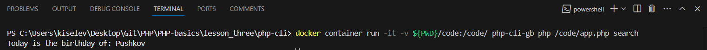
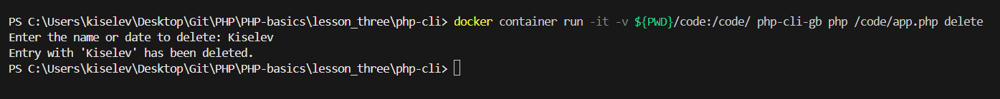

1. Error handling. Look at the implementation of the function in the [fwrite-cli.php](./fwrite-cli.php) file in the source code. Can a user enter incorrect information (for example, a date in the form 12-50-1548)? What other incorrect data can be entered? Fix this by adding the appropriate error handling.

- Incorrect date format:
  - Entering a date in the DD-MM-YYYY format may be incorrect, for example, 12-50-1548 (month 50 does not exist).
  - It also does not check if the date is valid (e.g. 31-02-2023).
- Check for the number of blocks:
  - The check for the number of blocks does not take into account that the date may be entered in the wrong format (e.g. 12-12).
- Logical errors:
  - The day and month checks use the wrong index to check the month ($dateBlocks[0] instead of $dateBlocks[1]).

It is necessary to enable a stricter check on the number of blocks in the validate function:

```php
if (count($dateBlocks) !== 3) {
return false;
}
```

Need to add a check for numeric values

```php
if (!is_numeric($day) || !is_numeric($month) || !is_numeric($year)) {
return false;
}
```

The day, month and year values ​​need to be converted to integers for further checks:

```php
$day = (int)$day;
$month = (int)$month;
$year = (int)$year;
```

It is necessary to add a check for date ranges:

```php
 if ($day < 1 || $day > 31 || $month < 1 || $month > 12 || $year < 1900 || $year > date('Y')) {
        return false;
    }
```

We can also use the checkdate function to check if a date is correct:

```php
if (!checkdate($month, $day, $year)) {
return false;
}
```

2. Searching the file. Once we have learned how to save data in a file, we may be interested not only in reading it, but also in searching it. For example, we need to check who needs to be congratulated on their birthday today among the users stored in the format:

Vasily Vasiliev, 05-06-1992

And here loops come to our aid again. We will need a loop that will read the file line by line and look for matches in the date. To process a line, the explode function will come in handy, and to get the current date - date.

Let's add a new function to the file [file.functions.php](./src/file.function.php):

```php
function findBirthdaysToday(array $config): string
{
    $address = $config['storage']['address'];

    if (!file_exists($address) || !is_readable($address)) {
        return handleError("The file does not exist or is not readable.");
    }

    $today = date('d-m'); // We get the current date in DD-MM format
    $birthdays = [];

    $file = fopen($address, "r");

    while (($line = fgets($file)) !== false) {
        // Remove extra spaces and newline characters
        $line = trim($line);
        if (!empty($line)) {
            list($name, $date) = explode(", ", $line);
            $date = trim($date);
            // Check if your date of birth matches today's
            if (date('d-m', strtotime($date)) === $today) {
                $birthdays[] = $name; // Adding a name to the array
            }
        }
    }

    fclose($file);

    if (empty($birthdays)) {
        return "There is no need to congratulate anyone on their birthday today";
    } else {
        return "Today is the birthday of: " . implode(", ", $birthdays);
    }
}

function searchFunction(array $config): string
{
    return findBirthdaysToday($config);
}
```



3. Deleting a line. Once we have learned how to search, we need to learn how to delete a specific line. Ask the user for the name or date for the line to be deleted. After entering, either delete the line and notify the user, or report that the line was not found.

Code:

```php
function deleteEntry(array $config): string
{
    $address = $config['storage']['address'];

    if (!file_exists($address) || !is_readable($address)) {
        return handleError("The file does not exist or is not readable.");
    }

    $searchTerm = readline("Enter the name or date to delete: ");
    $lines = file($address, FILE_IGNORE_NEW_LINES | FILE_SKIP_EMPTY_LINES);
    $found = false;

    // Filter the lines, excluding the one you want to delete
    $updatedLines = [];
    foreach ($lines as $line) {
        if (strpos($line, $searchTerm) === false) {
            $updatedLines[] = $line; // Leave line
        } else {
            $found = true; // Set a flag if the string is found
        }
    }

    // If the line is found, write the updated lines back to the file
    if ($found) {
        file_put_contents($address, implode(PHP_EOL, $updatedLines) . PHP_EOL);
        return "Entry with '$searchTerm' has been deleted.";
    } else {
        return "No entry found with '$searchTerm'.";
    }
}
```

- Read all lines from the file into an array, ignoring empty lines.
- Loop through all lines and add them to the new array if they do not contain the search term. If the line is found, set the $found flag.
- If the line was found, write the updated array of lines back to the file using file_put_contents.


